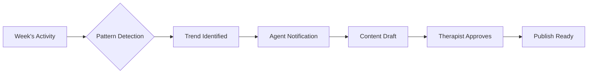
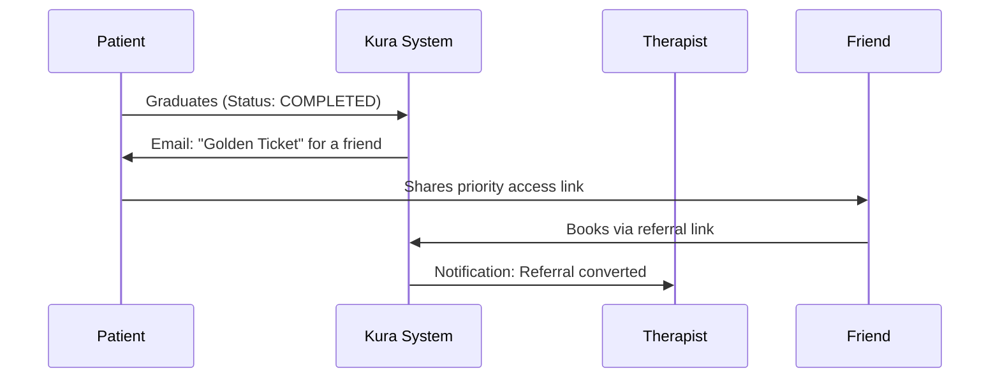

# ADR-003: Marketing Growth Engine

**Status:** 🟡 DEFERRED (Requires Legal Review)  
**Date:** 2024-12-24  
**Decision Makers:** Humbert (Product), GAG (Engineering)  
**Context:** Growth Strategy for 2026  

---

## Summary

This ADR documents a comprehensive therapist marketing automation system designed to fill schedules without requiring therapists to become influencers. Three vectors address different stages of patient acquisition: **Sanctuary Page** (attraction), **Content Alchemist** (awareness), and **Karma Loop** (referrals).

> **Philosophy**: "Make marketing invisible, ethical, and automatic. Not selling, but facilitating encounters."

---

## Problem Statement

1. **Therapists hate marketing** — They feel it "dirties" their sacred purpose
2. **Fragmented presence** — Linktree → Wix → SimplePractice = 80% visitor drop-off
3. **Content paralysis** — "I don't know what to post on Instagram"
4. **Wasted word-of-mouth** — Best acquisition channel, but never systematized

---

## Vector 1: "Sanctuary Page" (Personal Micro-Web)

### Concept
Auto-generated landing page from Kura profile. Replaces Linktree + booking page + lead forms.

### Visual Architecture
```
┌─────────────────────────────────────────────────────────┐
│  🎥 [VIDEO CIRCULAR]                                    │
│  "Hola, soy María. Acompaño procesos de..."            │
├─────────────────────────────────────────────────────────┤
│  [📅 Agendar Discovery 15min]   [📝 Test de Ansiedad]  │
│              [⏳ Unirse a Lista de Espera]              │
├─────────────────────────────────────────────────────────┤
│  ⭐⭐⭐⭐⭐ "Cambió mi vida" - Anónimo                     │
│  ⭐⭐⭐⭐⭐ "Lo recomiendo totalmente" - Anónimo           │
└─────────────────────────────────────────────────────────┘
```

### Key Features

| Feature | Description |
|---------|-------------|
| **Vibe-First Design** | Looks like a Bali retreat, not a clinic |
| **Story-Style Video** | Circular video header (familiar from Instagram) |
| **Direct Conversion** | Book, assess, or waitlist without leaving page |
| **Dynamic Social Proof** | Anonymous verified reviews auto-displayed |
| **Pixel Ready** | Meta/TikTok pixel pre-configured: "Paste ID here" |
| **Speed** | Target: <0.5s load time |

### URL Structure
```
sanctuary.kuraos.ai/maria
  - or -
kuraos.ai/t/maria
```

### Technical Requirements
- Video hosting: Cloudflare Stream or Mux
- Dynamic `<script>` injection per organization for pixels
- SSG (Static Site Generation) for speed
- Subdomain routing in Vercel

### Estimated Effort
**4-6 weeks** — Could be a standalone monetizable product.

---

## Vector 2: "Content Alchemist" (AI Content Agent)

### Concept
AI analyzes practice patterns to suggest ready-to-publish content.

### Workflow


### Key Features

| Feature | Description |
|---------|-------------|
| **Pattern Detection** | "5 patients this week with burnout" |
| **Friday Summary** | Weekly notification with content suggestions |
| **Hook Generator** | Instagram/LinkedIn copy with hashtags |
| **Audio-to-Post** | 2min voice memo → Newsletter + 3 Tweets |

### Example Notification
```
📱 Notificación - Viernes 17:00

"Parece que el Burnout es tendencia en tu consulta esta 
semana. He preparado un guion para un Reel de 30 segundos:
'3 señales de que tu jefe te está quemando'.

¿Quieres verlo?"

[Ver Guion] [Ignorar]
```

### ⚠️ Privacy Concerns

> **CRITICAL**: Clinical notes are PHI (Protected Health Information).

**PROPOSED APPROACH**: Do NOT analyze clinical notes directly.

**SAFE DATA SOURCES:**
- Services booked (aggregate counts)
- Form submissions (topics, not content)
- Booking patterns (time of day, service type)
- Public content the therapist already posted

**UNSAFE (Avoid):**
- Clinical entry content
- Patient-identifiable patterns
- Session transcripts

### Estimated Effort
**6-8 weeks** — Requires legal review on data processing boundaries.

---

## Vector 3: "Karma Loop" (Referral Automation)

### Concept
Systematize word-of-mouth at the perfect emotional moments.

### The "Golden Ticket" Flow


### Trigger Moments

| Trigger | Action |
|---------|--------|
| Patient Status → GRADUATED | Send Golden Ticket email |
| 5-Star Feedback | Offer referral incentive |
| 3+ Sessions Completed | Soft prompt: "Know someone?" |

### Golden Ticket Email Template
```
Asunto: Un regalo para alguien que lo necesite 💜

Hola [Nombre],

Me alegra mucho tu progreso en estos meses.

Si tienes algún amigo o familiar que esté pasando por un 
momento difícil, aquí tienes un "Pase de Prioridad" para 
que se salte la lista de espera en su primera sesión con
[Nombre Terapeuta].

[🎫 Compartir Pase de Prioridad]

Con cariño,
[Nombre Terapeuta]
```

### Derivation Network

For specialists who don't cover all needs:

| Scenario | Action |
|---------|--------|
| Psychologist doesn't treat children | Derive to colleague in Kura network |
| Agenda full | Suggest trusted alternatives |
| Patient relocates | Connect with Kura therapist in new city |

**Network Effect**: Creates a closed ecosystem where leaving Kura means losing referral network.

### Estimated Effort
**2-3 weeks** — Most implementable of the three. Builds on existing patient status system.

---

## Decision: DEFERRED

### Rationale

| Vector | Block | When Ready |
|--------|-------|------------|
| **Sanctuary Page** | Infrastructure (video, subdomains) | Q2-Q3 2026 |
| **Content Alchemist** | Legal review on data processing | 2027+ |
| **Karma Loop** | None — lowest complexity | Q2 2026 |

### Implementation Order (Recommended)

```
Q2 2026: Karma Loop (Referrals)
         └── Golden Ticket emails
         └── Referral tracking
         
Q3 2026: Sanctuary Page (Micro-Web)
         └── Video hosting integration
         └── Pixel configuration
         
2027+:   Content Alchemist (AI Content)
         └── After legal framework defined
         └── Privacy-safe data sources only
```

---

## Prerequisites

### Karma Loop
- [ ] Referral tracking in database (referred_by_patient_id)
- [ ] Email template for Golden Ticket
- [ ] Referral analytics dashboard

### Sanctuary Page
- [ ] Video hosting solution (Cloudflare Stream evaluation)
- [ ] Subdomain infrastructure in Vercel
- [ ] Page builder or template system
- [ ] Pixel injection mechanism

### Content Alchemist
- [ ] Legal review: What data can be analyzed?
- [ ] Privacy-preserving aggregation methods
- [ ] Audio transcription pipeline (Whisper)
- [ ] Content template library

---

## Success Metrics

| Vector | KPI | Target |
|--------|-----|--------|
| Sanctuary Page | Conversion rate (visit→book) | >5% |
| Content Alchemist | Posts published per therapist/month | 4+ |
| Karma Loop | Referral rate (graduated→referred) | >10% |

---

## References

- Original proposal: System Architect (December 2024)
- Analysis: GAG Engineering Review
- Competitors: Linktree, Stan.store, Practice Better
- Related: [ADR-002: Design System](./ADR-002-design-system-proposal.md) (Sanctuary Page aesthetics)

---

*This ADR will be revisited during Q2 2026 planning. Karma Loop may be fast-tracked if resources allow.*
