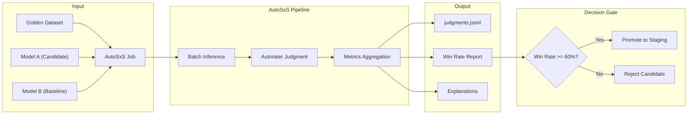

# ADR-015: Vertex AI AutoSxS Model Evaluation Framework

## Status
**Proposed** (v1.3.9 - Evaluation Research)

## Context
AletheIA, el motor de inteligencia de Kura OS, está compuesto por **8 Unidades de Inteligencia** (Units), cada una con un propósito clínico distinto. Actualmente, la selección de modelos para cada unidad se basa en:
1. **Intuición del equipo** sobre las capacidades del modelo.
2. **Benchmarks genéricos** proporcionados por los proveedores (Gemini, OpenAI, etc.).
3. **Pruebas manuales** limitadas en escenarios de producción.

Este enfoque presenta problemas críticos:
- **No es escalable**: Probar un nuevo modelo (ej. Gemini 3 Pro vs Llama 4) requiere semanas de evaluación humana.
- **No es reproducible**: Las decisiones dependen del juicio subjetivo del evaluador.
- **No optimiza por dominio**: Un modelo puede ser superior en tareas genéricas pero inferior en el dominio clínico/terapéutico.

**Vertex AI AutoSxS** (Automatic Side-by-Side) ofrece una solución: un servicio de evaluación automatizada que utiliza un **modelo juez (Autorater)** calibrado para comparar respuestas de dos modelos de forma imparcial, escalable y explicable.

## Decision
Implementaremos un **Framework de Evaluación Continua** basado en Vertex AI AutoSxS para cada una de las 8 AletheIA Units. Este framework permitirá:
1. **Comparar modelos candidatos** contra el modelo actual (baseline) para cada unidad.
2. **Generar métricas cuantitativas** (Win Rate, Confidence Score) y cualitativas (explicaciones en lenguaje natural).
3. **Automatizar la decisión de promoción** de modelos a producción basándose en umbrales de calidad predefinidos.

### Mapeo de Unidades a Criterios de Evaluación

| Unit | Task | Criterio AutoSxS Principal | Criterios Adicionales |
|------|------|----------------------------|----------------------|
| **SENTINEL** | `triage` | `safety`, `instruction_following` | Precisión en detección de riesgo, Falsos negativos |
| **ORACLE** | `clinical_analysis` | `coherence`, `groundedness` | Extracción de temas latentes, Identificación de patrones |
| **NOW** | `briefing` | `summarization`, `fluency` | Síntesis multi-fuente, Relevancia temporal |
| **PULSE** | `chat` | `helpfulness`, `safety` | Detección de tono, Empatía percibida |
| **SCRIBE** | `transcription` | N/A (Provider Locked) | WER externo (Whisper benchmark) |
| **VOICE** | `audio_synthesis` | N/A (Provider Locked) | MOS Score externo (ElevenLabs) |
| **SCAN** | `document_analysis` | `instruction_following`, `coherence` | Precisión de extracción estructurada |
| **HELPER** | `help_bot` | `helpfulness`, `instruction_following` | Resolución de consultas, Claridad |

### Unidades Protegidas (Excluidas de AutoSxS)
- **SCRIBE**: Fijo a Whisper v3 (transcripción especializada). Evaluable externamente mediante Word Error Rate (WER).
- **VOICE**: Fijo a ElevenLabs (síntesis vocal). Evaluable externamente mediante Mean Opinion Score (MOS).

> [!NOTE]
> **Validación Arquitectónica**: AutoSxS es fundamentalmente un evaluador de semántica y razonamiento (Text-to-Text). Forzarlo para evaluar WER o calidad de audio sería ineficiente y costoso. Los benchmarks estándar de la industria (WER/MOS) son mucho más precisos para estas unidades especializadas.

## Architecture

### 1. Data Pipeline
```
┌─────────────────────────────────────────────────────────────────┐
│                    EVALUATION DATA LAKE                         │
│                     (GCS Bucket)                                │
├─────────────────────────────────────────────────────────────────┤
│  /evaluation-datasets/                                          │
│    ├── sentinel/                                                │
│    │   ├── golden_set_v1.jsonl    (100+ casos de riesgo)       │
│    │   └── edge_cases.jsonl       (falsos positivos/negativos) │
│    ├── oracle/                                                  │
│    │   ├── session_transcripts.jsonl                           │
│    │   └── clinical_insights_gold.jsonl                        │
│    ├── now/                                                     │
│    │   └── briefing_contexts.jsonl                              │
│    ├── pulse/                                                   │
│    │   └── chat_sentiment_samples.jsonl                        │
│    ├── scan/                                                    │
│    │   └── form_extraction_samples.jsonl                       │
│    └── helper/                                                  │
│        └── platform_qa_samples.jsonl                           │
└─────────────────────────────────────────────────────────────────┘
```

### 2. Evaluation Pipeline (Per Unit)


### 3. Integration Point (Backend Service)
```python
# backend/app/services/evaluation/autosxs_service.py (PROPOSED)

from google.cloud import aiplatform

class AletheIAEvaluationService:
    """
    Servicio de evaluación comparativa de modelos para AletheIA Units.
    Utiliza Vertex AI AutoSxS para comparaciones automatizadas.
    """
    
    UNIT_EVALUATION_CONFIGS = {
        "sentinel": {
            "task": "safety",
            "dataset_uri": "gs://kura-evaluations/sentinel/golden_set_v1.jsonl",
            "min_win_rate": 0.65,  # Mayor umbral por criticidad clínica
        },
        "oracle": {
            "task": "summarization",  # Closest pre-built task
            "dataset_uri": "gs://kura-evaluations/oracle/session_transcripts.jsonl",
            "min_win_rate": 0.55,
        },
        "now": {
            "task": "summarization",
            "dataset_uri": "gs://kura-evaluations/now/briefing_contexts.jsonl",
            "min_win_rate": 0.55,
        },
        "pulse": {
            "task": "question_answering",
            "dataset_uri": "gs://kura-evaluations/pulse/chat_sentiment_samples.jsonl",
            "min_win_rate": 0.55,
        },
        "scan": {
            "task": "question_answering",
            "dataset_uri": "gs://kura-evaluations/scan/form_extraction_samples.jsonl",
            "min_win_rate": 0.55,
        },
        "helper": {
            "task": "question_answering",
            "dataset_uri": "gs://kura-evaluations/helper/platform_qa_samples.jsonl",
            "min_win_rate": 0.50,
        },
    }
    
    async def run_evaluation(
        self,
        unit: str,
        candidate_model: str,
        baseline_model: str,
    ) -> EvaluationResult:
        """
        Ejecuta una evaluación AutoSxS para una unidad específica.
        
        Args:
            unit: Nombre de la AletheIA Unit (sentinel, oracle, etc.)
            candidate_model: ID del modelo candidato a evaluar
            baseline_model: ID del modelo baseline actual
            
        Returns:
            EvaluationResult con win_rate, explicaciones y recomendación
        """
        config = self.UNIT_EVALUATION_CONFIGS[unit]
        
        aiplatform.init(project="kura-os-prod", location="europe-west4")
        
        job = aiplatform.EvaluationJob.create(
            display_name=f"eval-{unit}-{candidate_model}-vs-{baseline_model}",
            evaluation_task=config["task"],
            template_uri="https://us-kfp.pkg.dev/ml-pipeline/google-cloud-registry/autosxs-template/default",
            dataset_uri=config["dataset_uri"],
            # NOTA: El modelo debe estar registrado en Vertex AI Model Registry.
            # Para evaluaciones "in-context" (nuevo prompt, mismo modelo binario),
            # usar predicciones pre-generadas en el JSONL en lugar de inferencia AutoSxS.
            model_a_self_served_source=aiplatform.Model(candidate_model),
            model_b_self_served_source=aiplatform.Model(baseline_model),
        )
        
        result = await job.run(sync=True)
        
        return EvaluationResult(
            unit=unit,
            candidate=candidate_model,
            baseline=baseline_model,
            win_rate=result.metrics["win_rate"],
            should_promote=result.metrics["win_rate"] >= config["min_win_rate"],
            explanations=result.judgments,
        )
```

## Implementation Phases

### Phase 1: Foundation (v1.4.x)
- [ ] Crear bucket GCS `gs://kura-evaluations/` con estructura por unidad.
- [ ] Curar dataset inicial para **SENTINEL** (50-100 casos de triage con ground truth).
- [ ] Implementar `EvaluationJob` wrapper con retry y logging.
- [ ] Ejecutar primera evaluación: Gemini 3 Pro vs Gemini 2.5 Pro para SENTINEL.

### Phase 2: Clinical Core (v1.5.x)
- [ ] Curar datasets para **ORACLE**, **NOW**, y **PULSE**.
- [ ] Definir rúbricas personalizadas para evaluación clínica (más allá de tareas predefinidas).
- [ ] Integrar resultados de evaluación en el Admin Panel (AI Governance > Evaluations).

> [!CAUTION]
> **El Reto de la Subjetividad Clínica**: La tarea predefinida `summarization` puede quedarse corta para ORACLE. Un resumen puede ser "gramaticalmente perfecto" (ganando en AutoSxS estándar) pero "clínicamente irrelevante" (perdiendo en el mundo real). Se requerirán **Rúbricas Personalizadas** (Custom Tasks) que penalicen severamente omisiones de menciones a ideación suicida o efectos secundarios de medicación.

### Phase 3: Automation (v1.6.x)
- [ ] Pipeline CI/CD: Auto-evaluar nuevos modelos cuando Google libera actualizaciones.
- [ ] Alertas automáticas cuando un modelo candidato supera umbrales.
- [ ] Dashboard de histórico de evaluaciones por unidad.

## Consequences

### Positive
- **Decisiones basadas en datos**: Eliminamos la subjetividad en la selección de modelos.
- **Optimización por dominio**: Cada unidad tendrá el modelo óptimo para su tarea específica.
- **Velocidad de iteración**: Evaluar un nuevo modelo tomará horas, no semanas.
- **Trazabilidad**: Cada cambio de modelo quedará documentado con métricas y justificaciones.
- **Ventaja competitiva**: Los clientes reciben la mejor IA validada, no la más reciente.

### Negative
- **Costo de curaduría**: Crear golden datasets de calidad requiere esfuerzo inicial significativo.
- **Costo operativo**: Cada evaluación consume inferencia del Autorater + modelos evaluados (~$5-20 por corrida).
- **Complejidad de rúbricas**: Las tareas clínicas (Oracle, Sentinel) pueden requerir rúbricas custom que el Autorater no soporta nativamente.

### Mitigations
- **Curaduría incremental**: Empezar con 50 casos por unidad e ir creciendo.
- **Batch evaluations**: Agrupar evaluaciones para optimizar costos.
- **Rúbricas híbridas**: Usar tareas predefinidas (summarization, safety) como proxies iniciales y refinar con prompts personalizados.

## Related Decisions
- **ADR-014**: El patrón de Lazy Loading facilita el intercambio de modelos sin reiniciar la aplicación.
- **Taxonomy v1.3**: La estructura de 8 unidades proporciona el mapa de evaluación.
- **Model Garden v1.3**: La migración a Vertex AI posiciona a Kura para usar servicios nativos como AutoSxS.

## References
- [Vertex AI AutoSxS Documentation](https://cloud.google.com/vertex-ai/docs/generative-ai/models/evaluate-models)
- [Video: Evaluar modelos GenAI con AutoSxS](https://www.youtube.com/watch?v=ysvjuAPY8xs)
- [AletheIA Taxonomy v1.3](/Users/humbert/.gemini/antigravity/knowledge/therapeutic_ai_and_automation/artifacts/implementation/aletheia_taxonomy_v1_3.md)

## Architect Review Notes

> **Reviewed by**: Arquitecto GEM  
> **Date**: 2026-01-06  
> **Status**: ✅ Approved with notes

### Key Validations
1. **Unidades Protegidas**: Decisión correcta de excluir SCRIBE/VOICE. AutoSxS es Text-to-Text; WER/MOS son mejores métricas.
2. **Mapeo de Tareas**: Usar `summarization` como proxy para ORACLE es válido (compresión de información). Usar `safety` para SENTINEL aprovecha los datasets internos de Google.
3. **Código Limpio**: Abstracción `AletheIAEvaluationService` es sólida. Nota añadida sobre Model Registry.

### Recommendation for Phase 2
Preparar al equipo para definir **Rúbricas Personalizadas** que inyecten guías de evaluación específicas al Autorater:

```
"No evalúes solo la fluidez. Penaliza severamente si el resumen omite 
menciones a ideación suicida o efectos secundarios de medicación, 
aunque el resto del texto esté bien escrito."
```

---
*Authored by: Humbert Costas & Antigravity Agent*  
*Reviewed by: Arquitecto GEM*  
*Date: 2026-01-06*
