# ADR-016: Next-Gen Shield - Intelligent Safety & Privacy Layer

## Status

**Proposed** (v2.0 - Security Hardening)

## Context

Actualmente, el mecanismo de defensa de Kura OS ("Shield") depende de una lista estática de palabras prohibidas (`regex_blacklist`). Esto presenta riesgos críticos en un entorno clínico:

| Problema | Ejemplo | Impacto |
|----------|---------|---------|
| **Falsos Positivos** | "Quiero *matar* este hábito" | Bloquea contextos seguros por palabra literal |
| **Falsos Negativos** | Metáforas sutiles de autolesión | Evaden el filtro, riesgo real no detectado |
| **Riesgo de Privacidad** | Nombres, emails, teléfonos en prompts | Datos crudos al LLM, violación GDPR/HIPAA |

Necesitamos un sistema que entienda **contexto** (intención vs. palabra literal) y que proteja la **identidad** del paciente antes de que los datos toquen la IA.

## Decision

Reemplazar el sistema actual basado en Regex por una arquitectura de seguridad en **dos capas** utilizando servicios gestionados de Google Cloud:

1. **Capa de Privacidad (DLP):** Implementar **Sensitive Data Protection** (antes Cloud DLP) para la redacción automática y bidireccional de PII (Información Personal Identificable).
2. **Capa de Seguridad (Safety):** Implementar **Vertex AI Safety Settings** para la detección semántica de contenido dañino (odio, acoso, contenido peligroso) con umbrales ajustables por Unidad.

## Architecture

El nuevo flujo de inferencia introduce pasos de pre-procesamiento y post-procesamiento invisibles para el usuario final pero vitales para el sistema.

```mermaid
sequenceDiagram
    participant U as User (Patient)
    participant API as Kura API (Shield Controller)
    participant DLP as Google DLP Service
    participant VTX as Vertex AI (Model)
    
    U->>API: "Me llamo Juan y quiero acabar con todo."
    
    rect rgb(20, 20, 40)
        Note over API, DLP: LAYER 1: PRIVACY
        API->>DLP: Inspect & De-identify
        DLP-->>API: "Me llamo [PERSON_NAME] y quiero acabar con todo."
    end
    
    rect rgb(40, 20, 20)
        Note over API, VTX: LAYER 2: SEMANTIC SAFETY
        API->>VTX: Generate Content (Input: Sanitized Text)
        Note right of VTX: Safety Filters Check:<br/>- Hate Speech: OK<br/>- Dangerous Content: HIGH RISK
    end
    
    alt Dangerous Content Detected
        VTX-->>API: BlockedResponse (SafetySignal: High)
        API->>API: Trigger SENTINEL Protocol
        API-->>U: (Respuesta de Emergencia Predefinida)
    else Content Safe
        VTX-->>API: Generated Response
        API->>U: Response
    end
```



## Implementation Details

### 1. Configuración de Sensitive Data Protection (DLP)

Utilizaremos `google-cloud-dlp` para sanitizar los inputs. No guardaremos datos reales en los logs de la IA.

**InfoTypes a detectar:**

| InfoType | Descripción | Ejemplo |
|----------|-------------|---------|
| `PERSON_NAME` | Nombres propios | "Juan García" → `[PERSON_NAME]` |
| `PHONE_NUMBER` | Teléfonos | "+34 612 345 678" → `[PHONE_NUMBER]` |
| `EMAIL_ADDRESS` | Correos electrónicos | "juan@mail.com" → `[EMAIL_ADDRESS]` |
| `SPAIN_NIE_NUMBER` | NIE español | "X1234567A" → `[SPAIN_NIE_NUMBER]` |
| `SPAIN_NIF_NUMBER` | NIF/DNI español | "12345678A" → `[SPAIN_NIF_NUMBER]` |
| `LOCATION` | Direcciones | "Calle Mayor 15, Madrid" → `[LOCATION]` |

**Código de Ejemplo (Servicio de Desidentificación):**

```python
# backend/app/services/safety/privacy_shield.py

from google.cloud import dlp_v2

class PrivacyShield:
    """
    Capa de Privacidad del Next-Gen Shield.
    Sanitiza PII antes de que los datos lleguen al LLM.
    """
    
    def __init__(self, project_id: str):
        self.dlp = dlp_v2.DlpServiceClient()
        self.parent = f"projects/{project_id}"
        
        # Configuración de InfoTypes para contexto médico español
        self.info_types = [
            {"name": "PERSON_NAME"}, 
            {"name": "PHONE_NUMBER"},
            {"name": "EMAIL_ADDRESS"},
            {"name": "SPAIN_NIE_NUMBER"},
            {"name": "SPAIN_NIF_NUMBER"},
            {"name": "LOCATION"},
        ]
        
    def sanitize_input(self, text: str) -> SanitizedResult:
        """
        Desidentifica PII en el texto de entrada.
        
        Args:
            text: Texto crudo del usuario/paciente
            
        Returns:
            SanitizedResult con texto limpio y lista de findings
        """
        inspect_config = {
            "info_types": self.info_types,
            "min_likelihood": dlp_v2.Likelihood.LIKELIHOOD_UNSPECIFIED,
        }
        
        # Reemplazar datos reales con [TAGS]
        deidentify_config = {
            "info_type_transformations": {
                "transformations": [
                    {"primitive_transformation": {"replace_with_info_type_config": {}}}
                ]
            }
        }
        
        item = {"value": text}
        response = self.dlp.deidentify_content(
            request={
                "parent": self.parent,
                "deidentify_config": deidentify_config,
                "inspect_config": inspect_config,
                "item": item,
            }
        )
        
        return SanitizedResult(
            sanitized_text=response.item.value,
            findings=response.overview.transformation_summaries if response.overview else [],
            original_length=len(text),
            sanitized_length=len(response.item.value),
        )
```

### 2. Configuración de Vertex AI Safety Settings

Configuraremos umbrales diferentes según la **Unidad AletheIA**.

* **PULSE/NOW (Standard):** Bloqueo estricto. No queremos riesgos en conversaciones casuales.
* **SENTINEL (Clinical):** Permisividad controlada en el *Input* (necesitamos leer si el usuario está en riesgo), bloqueo estricto en el *Output* (el modelo no debe sugerir métodos de daño).

**Mapeo de Umbrales por Unidad:**

| Category | Standard Units (PULSE, NOW, HELPER) | Clinical Units (SENTINEL, ORACLE) |
|----------|-------------------------------------|-----------------------------------|
| **Hate Speech** | `BLOCK_LOW_AND_ABOVE` | `BLOCK_MEDIUM_AND_ABOVE` |
| **Dangerous Content** | `BLOCK_LOW_AND_ABOVE` | **`BLOCK_ONLY_HIGH`** (Input) |
| **Sexually Explicit** | `BLOCK_LOW_AND_ABOVE` | `BLOCK_MEDIUM_AND_ABOVE` |
| **Harassment** | `BLOCK_LOW_AND_ABOVE` | `BLOCK_MEDIUM_AND_ABOVE` |

> [!IMPORTANT]
> **SENTINEL** usa `BLOCK_ONLY_HIGH` para contenido peligroso porque necesita **leer** menciones de riesgo para poder detectarlas. Bloquear a nivel LOW impediría que el sistema detecte ideación suicida.

**Integración con GenerativeModel:**

```python
# backend/app/services/safety/semantic_shield.py

from vertexai.preview.generative_models import (
    GenerativeModel, 
    HarmCategory, 
    HarmBlockThreshold
)

class SemanticShield:
    """
    Capa de Seguridad Semántica del Next-Gen Shield.
    Detecta intención de daño, no solo palabras clave.
    """
    
    # Configuración para unidades estándar (restrictiva)
    STANDARD_SAFETY_SETTINGS = {
        HarmCategory.HARM_CATEGORY_DANGEROUS_CONTENT: HarmBlockThreshold.BLOCK_LOW_AND_ABOVE,
        HarmCategory.HARM_CATEGORY_HATE_SPEECH: HarmBlockThreshold.BLOCK_LOW_AND_ABOVE,
        HarmCategory.HARM_CATEGORY_HARASSMENT: HarmBlockThreshold.BLOCK_LOW_AND_ABOVE,
        HarmCategory.HARM_CATEGORY_SEXUALLY_EXPLICIT: HarmBlockThreshold.BLOCK_LOW_AND_ABOVE,
    }
    
    # Configuración para SENTINEL (permite analizar riesgo, bloquea generar daño)
    CLINICAL_SAFETY_SETTINGS = {
        HarmCategory.HARM_CATEGORY_DANGEROUS_CONTENT: HarmBlockThreshold.BLOCK_ONLY_HIGH,
        HarmCategory.HARM_CATEGORY_HATE_SPEECH: HarmBlockThreshold.BLOCK_MEDIUM_AND_ABOVE,
        HarmCategory.HARM_CATEGORY_HARASSMENT: HarmBlockThreshold.BLOCK_MEDIUM_AND_ABOVE,
        HarmCategory.HARM_CATEGORY_SEXUALLY_EXPLICIT: HarmBlockThreshold.BLOCK_MEDIUM_AND_ABOVE,
    }
    
    def get_safety_settings(self, unit: str) -> dict:
        """Retorna configuración de seguridad según la unidad AletheIA."""
        if unit in ("sentinel", "oracle"):
            return self.CLINICAL_SAFETY_SETTINGS
        return self.STANDARD_SAFETY_SETTINGS
    
    async def generate_with_safety(
        self,
        prompt: str,
        unit: str,
        model_name: str = "gemini-1.5-pro",
    ) -> SafetyResponse:
        """
        Genera contenido con filtros de seguridad semántica.
        
        Raises:
            RiskDetectedException: Si se detecta contenido de alto riesgo
        """
        model = GenerativeModel(model_name)
        safety_settings = self.get_safety_settings(unit)
        
        response = model.generate_content(
            [prompt],
            safety_settings=safety_settings
        )
        
        # Manejo de respuesta bloqueada
        if response.prompt_feedback and response.prompt_feedback.block_reason:
            # CRÍTICO: Dispara alerta al sistema humano si es SENTINEL
            if unit == "sentinel":
                await self.trigger_emergency_protocol(prompt, response.prompt_feedback)
            
            raise RiskDetectedException(
                reason=response.prompt_feedback.block_reason,
                safety_ratings=response.prompt_feedback.safety_ratings,
            )
        
        return SafetyResponse(
            text=response.text,
            safety_ratings=response.candidates[0].safety_ratings,
            blocked=False,
        )
```

### 3. Shield Controller (Orquestador)

El controlador integra ambas capas en un flujo unificado:

```python
# backend/app/services/safety/shield_controller.py

class NextGenShieldController:
    """
    Orquestador del Next-Gen Shield.
    Coordina las capas de Privacidad (DLP) y Seguridad (Safety).
    """
    
    def __init__(self, project_id: str):
        self.privacy_shield = PrivacyShield(project_id)
        self.semantic_shield = SemanticShield()
    
    async def process_input(
        self,
        raw_input: str,
        unit: str,
        patient_id: UUID,
    ) -> ShieldedInput:
        """
        Pipeline completo de protección para input del usuario.
        
        1. Sanitiza PII (Layer 1: Privacy)
        2. Valida seguridad semántica (Layer 2: Safety)
        """
        # Layer 1: Privacy Shield
        sanitized = self.privacy_shield.sanitize_input(raw_input)
        
        # Log de sanitización (para auditoría GDPR)
        await self.log_sanitization_event(
            patient_id=patient_id,
            findings_count=len(sanitized.findings),
            unit=unit,
        )
        
        return ShieldedInput(
            sanitized_text=sanitized.sanitized_text,
            pii_detected=len(sanitized.findings) > 0,
            ready_for_inference=True,
        )
    
    async def generate_response(
        self,
        shielded_input: ShieldedInput,
        unit: str,
        model_name: str,
    ) -> ShieldedOutput:
        """
        Genera respuesta con protección semántica.
        """
        # Layer 2: Semantic Safety
        response = await self.semantic_shield.generate_with_safety(
            prompt=shielded_input.sanitized_text,
            unit=unit,
            model_name=model_name,
        )
        
        return ShieldedOutput(
            text=response.text,
            safety_passed=not response.blocked,
            safety_ratings=response.safety_ratings,
        )
```

## Consequences

### Positive

| Beneficio | Descripción |
|-----------|-------------|
| **Inteligencia Contextual** | El sistema distingue entre un ataque y un relato de dolor |
| **Cumplimiento Normativo** | DLP asegura anonimización incluso si ocurriera una brecha |
| **Escalabilidad** | No hay listas que mantener. Las actualizaciones de Google nos benefician automáticamente |
| **Auditabilidad** | Logs detallados de sanitización y detecciones para compliance |

### Negative

| Aspecto | Impacto | Mitigación |
|---------|---------|------------|
| **Latencia** | DLP añade ~50-100ms por request | Caché para textos repetitivos |
| **Costo** | DLP cobra por caracteres inspeccionados | El volumen de texto clínico es bajo |
| **Respuestas robóticas** | `[PERSON_NAME]` puede sonar impersonal | Instruir al modelo para usar "tú" |

## Next Steps

1. [ ] Activar API de **Sensitive Data Protection** en el proyecto `kura-os-prod`
2. [ ] Definir lista exacta de `InfoTypes` relevantes para España (DNI, Seguridad Social)
3. [ ] Implementar clase `PrivacyShield` en el middleware de `AletheIA`
4. [ ] Implementar clase `SemanticShield` con configuración por unidad
5. [ ] Crear `NextGenShieldController` como orquestador
6. [ ] Tests con dataset de casos edge (falsos positivos/negativos históricos)

## Related Decisions

- **ADR-015**: AutoSxS puede evaluar la calidad de detección del nuevo Shield
- **ADR-017**: Los modelos fine-tuned heredan la configuración de seguridad
- **ADR-018**: Vector Search indexa datos post-sanitización (nunca PII crudo)
- **Taxonomy v1.3**: SENTINEL es la unidad responsable del protocolo de emergencia

## References

- [Vertex AI Safety Attributes](https://cloud.google.com/vertex-ai/docs/generative-ai/learn/responsible-ai)
- [Sensitive Data Protection (Cloud DLP)](https://cloud.google.com/dlp/docs)
- [GDPR Compliance with Cloud DLP](https://cloud.google.com/architecture/gdpr-compliance-with-dlp)
- [Spain-specific InfoTypes](https://cloud.google.com/dlp/docs/infotypes-reference#spain)

---
*Authored by: Humbert Costas & Antigravity Agent*  
*Date: 2026-01-06*
