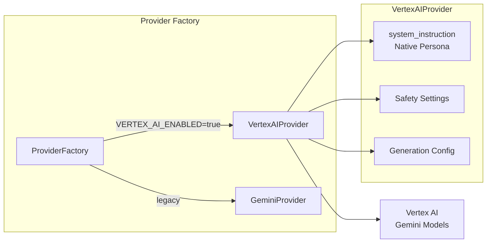
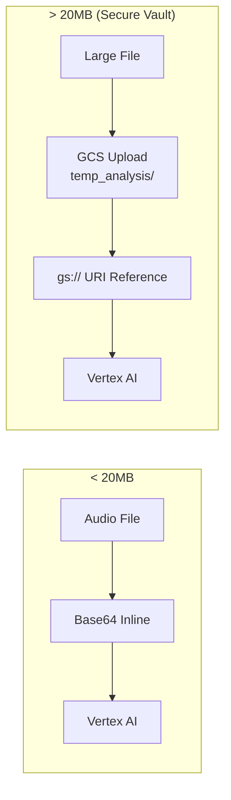
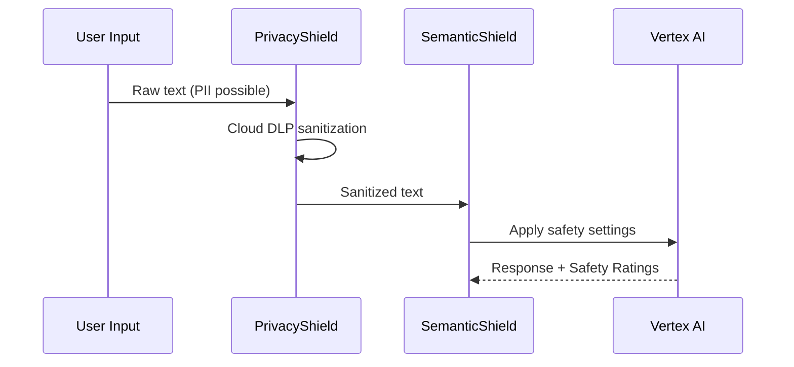
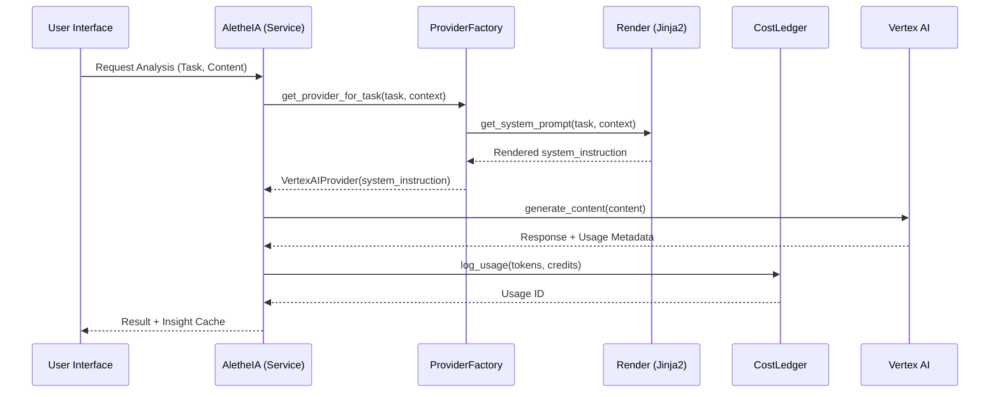
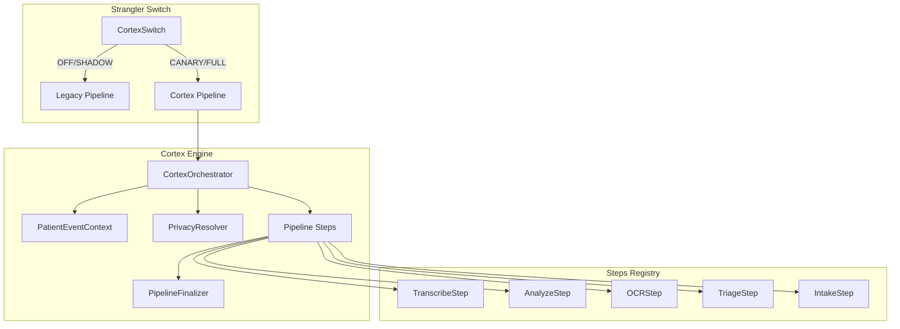

# AletheIA System Architecture

> **Status**: Production (v1.7.7)  
> **Last Updated**: 2026-01-12  
> **Source of Truth**: Authoritative documentation for the AletheIA Intelligence Engine.

---

## 1. Overview

**AletheIA** (from Greek ἀλήθεια, "truth/disclosure") is Kura OS's clinical intelligence engine. It's the **cognitive layer** that transforms raw clinical data into actionable insights, risks, and therapeutic guidance.

> **Philosophy**: Context is King. Kura captures the full patient journey—clinical notes, audio sessions, intake forms, chat sentiment—and applies a specialized set of AI units to reveal what matters. The therapist remains sovereign; AletheIA illuminates.

```
┌─────────────────────────────────────────────────────────────────┐
│                    ALETHEIA ECOSYSTEM (9 UNITS)                 │
├──────────────────┬──────────────────┬───────────────────────────┤
│   INTELLIGENCE   │   AUTOMATION     │   INTERFACE               │
│   (The Core)     │   (The Agents)   │   (The HUD)               │
├──────────────────┼──────────────────┼───────────────────────────┤
│ • ORACLE / SCRIBE│ • CONCIERGE      │ • Sentinel Pulse          │
│ • SENTINEL / NOW │ • GHOST DETECTOR │ • Focus Session Card      │
│ • PULSE / SCAN   │ • COLLECTOR      │ • Observatory Sidebar     │
│ • VOICE / HELPER │ • SECURITY SHIELD│ • Daily Briefing          │
└──────────────────┴──────────────────┴───────────────────────────┘
```

---

## 2. The 9 Units of Intelligence

AletheIA is divided into 9 specialized units, each mapped to specific tasks and routing logic.

| Unit | Role | Primary Task | Task Routing |
|:---|:---|:---|:---|
| **ORACLE** | Clinical Sage | Clinical Analysis | `clinical_analysis` |
| **SENTINEL** | Safety Guardian| Form Triage | `triage`, `form_analysis` |
| **NOW** | Morning Pulse | Daily Briefing | `briefing` |
| **PULSE** | Emotional ECG | Chat Analysis | `chat` |
| **SCRIBE** | Voice Memory | Transcriptions | `transcription` |
| **VOICE** | Patient Echo | Audio Synthesis | `audio_synthesis` |
| **MEMO** | Quick Notes | Short Audio JSON | `audio_memo` |
| **SCAN** | Visual Intake | Document OCR | `document_analysis` |
| **HELPER** | User Support | Support Assistant| `help_bot` |

---

## 3. Intelligence Core (Backend)

### 3.1 Sovereign Infrastructure (v1.4.0+)

As of v1.4.0, AletheIA runs on **Google Vertex AI** with enterprise-grade authentication:

| Layer | Technology | Benefit |
|:---|:---|:---|
| **SDK** | `google-cloud-aiplatform` | Enterprise Vertex AI SDK |
| **Auth** | ADC (Application Default Credentials) | Zero API keys in production |
| **Location** | `europe-west1` | EU Data Residency / GDPR Compliance |
| **Fallback** | Auto-inference from ADC | Zero-config Cloud Run deploys |

```python
# v1.4.3: Auto-resolve project from ADC
def _resolve_project_id() -> str:
    if settings.GOOGLE_PROJECT_ID:
        return settings.GOOGLE_PROJECT_ID
    _, project = google.auth.default()  # Cloud Run native
    return project
```

### 3.2 Provider Architecture

**File**: `backend/app/services/ai/providers/vertex.py`

The `VertexAIProvider` is the primary inference engine, supporting:

- **Text Analysis**: Clinical notes, form submissions, chat transcripts
- **Audio Analysis**: Native multimodal (Gemini 2.5+ only)
- **Document Analysis**: PDF, images, clinical documents
- **Large Media (>20MB)**: Automatic routing via GCS (v1.4.2)



### 3.3 Native Prompt Engineering (ADR-021, v1.4.4)

AletheIA uses **native `system_instruction`** instead of concatenated prompts, providing:

| Aspect | Before (v1.4.2) | After (v1.4.4) |
|:---|:---|:---|
| Prompt Delivery | Concatenated as user content | Native `system_instruction` parameter |
| Model Adherence | Lower attention weight | Higher role adherence |
| Security | Vulnerable to prompt injection | Better jailbreak resistance |
| Management | Hardcoded Python strings | Versioned Jinja2 templates |

**Template System**:

```
backend/app/services/ai/
├── render.py              # Template engine
└── templates/
    ├── clinical_v1.jinja2   # ORACLE
    ├── audio_v1.jinja2      # VOICE
    ├── document_v1.jinja2   # SCAN
    ├── form_v1.jinja2       # SENTINEL (generic)
    ├── triage_v1.jinja2     # SENTINEL (safety)
    ├── chat_v1.jinja2       # PULSE
    └── help_v1.jinja2       # HELPER
```

Templates support dynamic context injection via Jinja2:

```python
# Example: Triage with patient flags
system_prompt = get_system_prompt("triage", {"flags": "Cardiac history, SSRI"})
```

### 3.4 Task Routing & Governance

The mapping between Clinical Units and LLM Models is managed via the **AiGovernance** panel.

- **Default Routing**: Defined in `seed_routing.py`.
- **Persistence**: Stored in `SystemSetting` table (`AI_TASK_ROUTING`).
- **Resolution**: Models are fetched via `ProviderFactory.get_provider_for_task(db, task)`.

### 3.5 Available Models

**File**: `backend/app/services/ai/model_registry.py`

| Model ID | Provider | Tier | Optimized For | Audio |
|:---|:---|:---|:---|:---|
| `gemini-3-pro` | Vertex AI | FLAGSHIP | Advanced Reasoning, Complex Analysis | ✅ |
| `gemini-3-flash-preview` | Vertex AI | NEXT-GEN | Fast + Capable (Preview) | ✅ |
| `gemini-2.5-pro` | Vertex AI | CRITICAL | Complex Clinical Analysis (ORACLE) | ✅ |
| `gemini-2.5-flash` | Vertex AI | FAST | Standard Analysis (VOICE/NOW) | ✅ |
| `gemini-2.5-flash-lite`| Vertex AI | BUDGET | High-Volume Tasks (HELPER) | ✅ |
| `gemini-2.0-flash` | Vertex AI | LEGACY | Backwards Compatibility | ✅ |
| `whisper-1` | OpenAI | VOICE | WhatsApp Audio Transcriptions | N/A |

**Cost Structure** (per 1M tokens, USD):

| Model | Input | Output |
|:---|:---|:---|
| gemini-3-pro | $2.00 | $12.00 |
| gemini-3-flash-preview | $0.50 | $3.00 |
| gemini-2.5-pro | $1.25 | $10.00 |
| gemini-2.5-flash | $0.15 | $0.60 |
| gemini-2.5-flash-lite | $0.10 | $0.40 |

### 3.6 Large Media Processing (v1.4.2)

For audio/video files exceeding Vertex AI's inline limit (20MB), AletheIA uses the **Upload-then-Reference** pattern:



**Security**: Large files are stored in `kura-production-vault` (private bucket) with:
- EU Data Residency (`europe-west1`)
- Lifecycle rules for automatic cleanup
- No public access (Service Account only)

---

## 4. The Neural Ledger (AletheIA Economy)
**File**: `backend/app/services/ai/ledger.py`

### 4.1 Kura Credits (KC) Standard
Kura OS uses a virtual economy to stabilize costs and ensure sustainability.

- **Ratio**: €1.00 = 1,000 KC.
- **Margin**: 1.5x (50% markup) over real provider costs.
- **Conversion Formula**:
  ```python
  KC = (cost_provider_usd_in_eur * 1000) * 1.5
  ```

### 4.2 Unit Monetization
| Unit | Billing Policy |
|:---|:---|
| **Clinical Units** (8/9) | Billable in KC (Paid by Organization) |
| **HELPER** | 🆓 Free for User (Cost absorbed by Kura OS as Support) |

Every AI operation generates an `AiUsageLog` entry with both real provider cost (€) and user cost (KC).

---

## 5. Observability (ADR-019, v1.4.2)

AletheIA operations are fully instrumented for production debugging:

| Tool | Purpose | Activation |
|:---|:---|:---|
| **Cloud Trace** | Distributed latency tracing | Auto in Cloud Run |
| **Cloud Profiler** | CPU/Memory profiling | Production only |
| **AiUsageLog** | Cost and token tracking | All environments |

**File**: `backend/app/core/telemetry.py`

```python
# Silent fallback for local development
def init_telemetry(app: FastAPI):
    if not os.environ.get("K_SERVICE"):
        return  # Skip locally
    
    # OpenTelemetry + Cloud Trace integration
    tracer_provider = TracerProvider(resource=Resource.create({...}))
    tracer_provider.add_span_processor(BatchSpanProcessor(CloudTraceSpanExporter()))
```

---

## 6. Analysis Protocols

### 6.1 Next-Gen Shield (v1.7.7) ⭐ PREMIUM
**File**: `backend/app/services/safety/` (WU-016, ADR-016)

> **Evolution**: Replaced keyword-based regex detection with intelligent, context-aware protection.

The **Next-Gen Shield** is a two-layer security architecture that protects clinical AI inference:



| Layer | Component | Purpose |
|:---|:---|:---|
| **Layer 1** | `PrivacyShield` | Cloud DLP for PII sanitization (GDPR/HIPAA) |
| **Layer 2** | `SemanticShield` | Vertex AI Safety with unit-specific thresholds |
| **Orchestrator** | `NextGenShieldController` | Unified coordination + audit logging |

**InfoTypes Detected (Cloud DLP):**
- `PERSON_NAME`, `PHONE_NUMBER`, `EMAIL_ADDRESS`
- `SPAIN_NIE_NUMBER`, `SPAIN_NIF_NUMBER`, `CREDIT_CARD_NUMBER`
- `LOCATION`

**Safety Profiles:**

| Profile | Units | Dangerous Content Threshold |
|:---|:---|:---|
| **STANDARD** | HELPER, PULSE, NOW | `BLOCK_LOW_AND_ABOVE` (Strict) |
| **CLINICAL** | SENTINEL, ORACLE, CORTEX | `BLOCK_ONLY_HIGH` (Permissive Input) |

> [!IMPORTANT]
> **Clinical Sovereignty**: Clinical units can **read** mentions of risk (suicidal ideation, self-harm) to detect them, but are blocked from **generating** harmful content. This is essential for SENTINEL's triage function.

**Key Benefits:**
- ✅ Context-aware: Distinguishes "quiero matar este hábito" from actual harm intent
- ✅ PII Protection: Patient names, phones, emails masked before LLM inference
- ✅ Fail-Safe: DLP errors trigger fail-open with critical alerts (clinical workflow continues)
- ✅ GDPR/HIPAA: Audit logs for all PII detections

### 6.2 Engagement Score
**File**: `backend/app/api/v1/insights.py` → `_generate_fallback_insights()`

```python
engagement = 50                      # Base score
engagement += 20 if entries else 0   # Has clinical notes
engagement += 15 if bookings else 0  # Has appointments
engagement -= 20 if critical_alert   # Critical issues
engagement -= 10 if warning_alert    # Warnings
# Final: max(0, min(100, engagement))
```

| Score | Color | Status |
|:---|:---|:---|
| ≥ 70 | 🟢 Green | Healthy engagement |
| 40-69 | 🟡 Amber | Needs attention |
| < 40 | 🔴 Red | At risk |

### 6.3 Thematic Pills
Extracted clinical themes for quick review:

| Raw Note | Extracted Themes |
|:---|:---|
| "Pérdida de su madre hace 3 meses..." | `["Grief", "Family"]` |
| "Experiencia con psilocibina..." | `["Spiritual Emergency", "Integration"]` |

**Fallback themes**: `"Nuevo paciente"`, `"Bloqueo médico"`, `"Estancamiento"`, `"Pago pendiente"`

---

## 7. User Experience (Frontend)

### 7.1 Daily Briefing
**Component**: Dashboard widget  
**API**: `GET /api/v1/insights/daily-briefing`

Audio-first morning summary for practitioners:

```
Aggregation → Scripting (Gemini) → TTS (OpenAI) → Caching
```

| Data Source | Content |
|:---|:---|
| Calendar | Today's appointment count |
| Clinical Risk | HIGH/MEDIUM patients scheduled today |
| Financials | Pending payments (24h) |
| CRM | PendingActions awaiting approval |

**Output**: MP3 audio + text transcript. Cached in `static/briefings/`.

### 7.2 Observatory Sidebar
**Component**: `components/AletheiaObservatory.tsx`

| Widget | Purpose |
|:---|:---|
| Risk Score | -1.0 to +1.0 gauge |
| Risk Trend | 72h trend indicator |
| Voice Analysis | Tone, latency, depression % |
| Active Flags | Detected risk markers |
| Biomarkers | HRV, Sleep (Oura planned) |

**Visibility**: `xl` screens only (`hidden xl:flex`, `w-80`)

### 7.3 Help ChatBot
**Component**: `components/help/HelpChatBot.tsx`

- Platform-specific support grounded in MDX docs
- Session-aware (user role, tier, current page)
- Queries logged to `HelpQueryLog`
- **v1.4.2**: Migrated to Vertex AI via `ProviderFactory`

### 7.4 Sentinel Pulse (Real-Time Monitor)
**Component**: `apps/platform/components/SentimentPulseWidget.tsx`

The emotional ECG/HRV widget showing the patient's 7-day emotional trajectory.

| Aspect | Detail |
|:---|:---|
| **Data Source** | `Patient.last_insight_json.risk_score` |
| **Metric Range** | -1.0 (Crisis) to +1.0 (Stable) |
| **Location** | Clinical Canvas (Patient Profile - Right Column) |
| **Update Frequency** | On each clinical entry analysis |

**Visual States:**

| State | Condition | Appearance |
|:---|:---|:---|
| 🟢 **Active** | Data available | Green/Red gradient timeline |
| 👻 **Dormant** | No recent data (>7 days) | Ghost-faded graph |
| 🔒 **Locked** | BUILDER tier | Upsell overlay |

> [!IMPORTANT]
> **Data Coherence Rule**: Sentinel Pulse risk score MUST exactly match `Patient.last_insight_json.risk_score`. Any mismatch indicates a cache invalidation bug.

### 7.5 Focus Session Card (The Oracle)
**Component**: `apps/platform/components/dashboard/FocusSessionCard.tsx`

The Dashboard Hero widget that preps the therapist in seconds.

| Aspect | Detail |
|:---|:---|
| **Location** | Dashboard (Top-Left Hero Position) |
| **Purpose** | Show the *immediate* next session context |
| **Data** | Next booking + patient's last AletheIA insight |

**Content Display:**
- Patient name + profile photo
- Service type + scheduled time
- **Last Insight Summary**: The most recent `last_insight_json` excerpt
- Risk indicators (if any HIGH/MEDIUM flags)

> **Status**: 🟡 Currently uses mock insight data. Wiring to live API pending (see `technical-debt.md`).

---

## 8. Automation Agents

### 8.1 Philosophy: "Agents, Not Tools"
AI operates as **autonomous teammates**, not passive software.

| Legacy Term | New Term |
|:---|:---|
| Playbook | Protocolo |
| Install | Activar |
| Marketplace | Catálogo de Agentes |
| Automation | Agente IA |

### 8.2 Active Agents

| Agent | Trigger | Action |
|:---|:---|:---|
| **Concierge** | `LEAD_CREATED` | Welcome email + booking nudge |
| **Ghost Detector** | `LEAD_STAGED_TIMEOUT` (48h) | Re-engagement message |
| **Security Shield** | `RISK_DETECTED` (HIGH) | Block patient + alert (CENTER only) |
| **Collector** | `PAYMENT_FAILED` | 48h payment reminder |

### 8.3 Human-in-the-Loop (HITL)
- **Draft Mode**: `agent_config.mode == 'DRAFT_ONLY'`
- **PendingActions Table**: Stores drafted communications
- **Approval Widget**: Dashboard View/Edit/Approve/Reject

### 8.4 Event Types
```python
class EventType(str, Enum):
    FORM_SUBMISSION_COMPLETED = "FORM_SUBMISSION_COMPLETED"
    PAYMENT_SUCCEEDED = "PAYMENT_SUCCEEDED"
    PAYMENT_FAILED = "PAYMENT_FAILED"
    BOOKING_CONFIRMED = "BOOKING_CONFIRMED"
    JOURNEY_STAGE_TIMEOUT = "JOURNEY_STAGE_TIMEOUT"
    RISK_DETECTED_IN_NOTE = "RISK_DETECTED_IN_NOTE"
    LEAD_CREATED = "LEAD_CREATED"
    LEAD_STAGED_TIMEOUT = "LEAD_STAGED_TIMEOUT"
```

---

## 9. Registry

### 9.1 Prompts & Templates

**Legacy File**: `backend/app/services/ai/prompts.py`  
**Modern System**: `backend/app/services/ai/templates/*.jinja2` (v1.4.4+)

| Template | Unit | Purpose | Variables |
|:---|:---|:---|:---|
| `clinical_v1.jinja2` | ORACLE | Structured clinical assessment | None |
| `audio_v1.jinja2` | VOICE | Session synthesis (not verbatim) | None |
| `document_v1.jinja2` | SCAN | Document type + clinical relevance | None |
| `form_v1.jinja2` | SENTINEL | Generic intake form review | None |
| `triage_v1.jinja2` | SENTINEL | Safety screening (SSRIs, MAOIs) | `{{ flags }}` |
| `chat_v1.jinja2` | PULSE | Daily sentiment + risk flags (JSON) | None |
| `help_v1.jinja2` | HELPER | Zero-hallucination platform help | `{{ locale }}`, `{{ user_name }}`, `{{ tier }}`, `{{ route }}` |

**Characteristics**:
- All prompts end with: `"Respond in the same language as the input content."`
- Therapeutic lineage sensitivity (astrology, psychedelic, somatic)
- Audio analysis = synthesis, not transcription
- Jinja2 templating for dynamic context injection

### 9.2 Key Files

| Component | File |
|:---|:---|
| Main Service | `backend/app/services/aletheia.py` |
| Factory | `backend/app/services/ai/factory.py` |
| **Vertex AI Provider** | `backend/app/services/ai/providers/vertex.py` |
| Legacy Gemini Provider | `backend/app/services/ai/providers/gemini.py` |
| Template Renderer | `backend/app/services/ai/render.py` |
| Cost Ledger | `backend/app/services/ai/ledger.py` |
| Risk Detector | `backend/app/services/risk_detector.py` |
| Insights API | `backend/app/api/v1/insights.py` |
| Automation Engine | `backend/app/services/automation_engine.py` |
| Stale Monitor | `backend/app/workers/stale_journey_monitor.py` |
| Help Assistant | `backend/app/services/help_assistant.py` |
| Financial Reports | `backend/app/services/finance/internal_ledger.py` |
| Telemetry | `backend/app/core/telemetry.py` |
| Vault Storage | `backend/app/services/storage.py` |

### 9.3 Data Flow



---

## 10. Evolution Timeline

| Version | Codename | Key Changes |
|:---|:---|:---|
| v1.3.5 | Async Sovereignty | Full async, ProviderFactory JIT |
| v1.3.6 | Model Garden | Task routing, AI Governance panel |
| **v1.4.0** | **Sovereign Intelligence** | Vertex AI migration, ADC auth |
| v1.4.2 | Deep Listening | Large audio (>20MB), Cloud Trace/Profiler |
| v1.4.3 | Resilient AI | ADC auto-inference, upload UX |
| **v1.4.4** | **Native Intelligence** | ADR-021 Jinja2 templates, native `system_instruction` |
| **v1.5.0** | **Cortex Foundation** | Privacy Tiers, PatientEventContext, PipelineFinalizer |
| v1.5.1 | Cortex Engine | CortexOrchestrator, Pipeline Steps (transcribe, analyze, ocr) |
| v1.5.2 | Cortex API | Privacy endpoints, backfill script |
| **v1.5.3** | **Strangler Switch** | Traffic routing, gradual migration |

---

## 12. Kura Cortex (v1.5+)

Kura Cortex is the **next-generation cognitive pipeline engine** that orchestrates clinical AI workflows with privacy-first data handling.

### 12.1 Architecture Overview



### 12.2 Privacy Tiers (HIPAA/GDPR)

| Tier | Behavior | Use Case |
|:---|:---|:---|
| **GHOST** | RAM-only, delete everything | Ultra-sensitive sessions |
| **STANDARD** | Keep transcript, delete raw audio | GDPR default (EU) |
| **LEGACY** | Archive raw to cold storage | BAA-covered AI training (US) |

**Waterfall Inheritance:**
1. Patient Override (`privacy_tier_override`)
2. Organization Default (`default_privacy_tier`)
3. Country Default (COUNTRY_DEFAULTS map)

### 12.3 Core Components

| Component | File | Purpose |
|:---|:---|:---|
| **CortexOrchestrator** | `services/cortex/orchestrator.py` | Pipeline execution engine |
| **PatientEventContext** | `services/cortex/context.py` | Blackboard pattern for HIPAA |
| **PrivacyResolver** | `services/cortex/privacy.py` | Waterfall tier resolution |
| **PipelineFinalizer** | `services/cortex/privacy.py` | Data retention enforcement |
| **CortexSwitch** | `services/cortex/switch.py` | Strangler pattern routing |
| **CortexAdapter** | `services/cortex/adapter.py` | Legacy/Cortex bridge |

### 12.4 Pipeline Steps

| Step | Task Type | Input → Output |
|:---|:---|:---|
| `transcribe` | Audio → Text | Uses Vertex AI Speech-to-Text |
| `analyze` | Text → Clinical Insights | ORACLE prompt template |
| `ocr` | Image/PDF → Text | Document digitization |
| `triage` | Text → Risk Assessment | SENTINEL screening |
| `intake` | Form JSON → Structured Text | Normalization |

### 12.5 Strangler Switch States

| State | Percentage | Behavior |
|:---|:---|:---|
| `OFF` | 0% | 100% legacy, Cortex dormant |
| `SHADOW` | 0% | Legacy runs, Cortex logs only |
| `CANARY` | 1-25% | Small percentage to Cortex |
| `ROLLOUT` | 26-99% | Gradual increase |
| `FULL` | 100% | 100% Cortex |

**Configuration:**
```python
# Admin: Enable Cortex for specific org
CortexSwitch.add_to_allowlist(org_id)

# Gradual rollout: 25%
CortexSwitch.set_state(SwitchState.CANARY, percentage=25)

# Full migration
CortexSwitch.set_state(SwitchState.FULL)
```

### 12.6 API Endpoints

| Endpoint | Method | Purpose |
|:---|:---|:---|
| `/org/privacy` | GET/PATCH | Organization privacy config |
| `/patients/{id}/privacy` | GET/PATCH/DELETE | Patient privacy override |

---

## 11. Future Roadmap

| ADR | Feature | Status |
|:---|:---|:---|
| **ADR-016** | **Next-Gen Shield (Cloud DLP + Vertex AI Safety)** | ✅ **v1.7.7** |
| ADR-017 | Supervised Fine-Tuning for Clinical Personas | 📋 Planned |
| ADR-018 | Vector Search & Long-Term Memory | 📋 Planned |
| ADR-020 | Golden Datasets for Evaluation | 📋 Planned |

---

> **"Context is King. AletheIA illuminates; the therapist decides."**  
> **"Privacy is non-negotiable. Cortex enforces it."**
