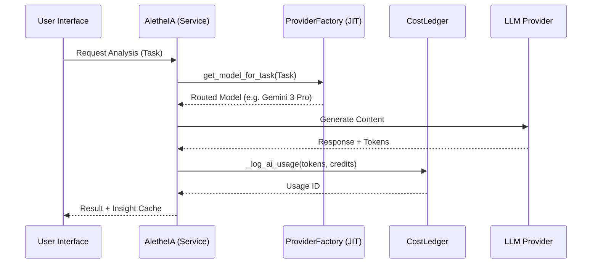

# AletheIA System Architecture

> **Status**: Production (v1.3.6)  
> **Last Updated**: 2026-01-06  
> **Source of Truth**: Authoritative documentation for the AletheIA Intelligence Engine.

---

## 1. Overview

**AletheIA** (from Greek ἀλήθεια, "truth/disclosure") is Kura OS's clinical intelligence engine. It analyzes patient data to reveal patterns, risks, and actionable insights for therapists.

```
┌─────────────────────────────────────────────────────────────────┐
│                    ALETHEIA ECOSYSTEM (8 UNITS)                 │
├──────────────────┬──────────────────┬───────────────────────────┤
│   INTELLIGENCE   │   AUTOMATION     │   INTERFACE               │
│   (The Core)     │   (The Agents)   │   (The HUD)               │
├──────────────────┼──────────────────┼───────────────────────────┤
│ • ORACLE / SCRIBE│ • CONCIERGE      │ • Sentinel Pulse          │
│ • SENTINEL / NOW │ • GHOST DETECTOR │ • Focus Session Card      │
│ • PULSE / SCAN   │ • COLLECTOR      │ • Observatory Sidebar     │
│ • VOICE / HELPER │ • SECURITY SHIELD│ • Daily Briefing          │
└──────────────────┴──────────────────┴───────────────────────────┘
```

---

## 2. The 8 Units of Intelligence

AletheIA is divided into 8 specialized units, each mapped to specific tasks and routing logic.

| Unit | Role | Primary Task | Task Routing |
|:---|:---|:---|:---|
| **ORACLE** | Clinical Sage | Clinical Analysis | `clinical_analysis` |
| **SENTINEL** | Safety Guardian| Form Triage | `triage`, `form_analysis` |
| **NOW** | Morning Pulse | Daily Briefing | `briefing` |
| **PULSE** | Emotional ECG | Chat Analysis | `chat` |
| **SCRIBE** | Voice Memory | Transcriptions | `transcription` |
| **VOICE** | Patient Echo | Audio Synthesis | `audio_synthesis` |
| **SCAN** | Visual Intake | Document OCR | `document_analysis` |
| **HELPER** | User Support | Support Assistant| `help_bot` |

---

## 3. Intelligence Core (Backend)

### 3.1 Provider Sovereign Architecture (Async)
**File**: `backend/app/services/aletheia.py`

As of v1.3.5, AletheIA is **strictly asynchronous**. It achieves 100% provider sovereignty via the `ProviderFactory`, which instantiates models Just-In-Time (JIT) based on the current **Task Routing** configuration.

### 3.2 Task Routing & Governance
The mapping between Clinical Units and LLM Models is managed via the **AiGovernance** panel.

- **Default Routing**: Defined in `seed_routing.py`.
- **Persistence**: Stored in `SystemSetting` table (`AI_TASK_ROUTING`).
- **Resolution**: Models are fetched via `ProviderFactory.get_model_for_task(db, task)`.

### 3.3 Available Models
**File**: `backend/app/services/ai/model_registry.py`

| Model ID | Provider | Tier | Optimized For |
|:---|:---|:---|:---|
| `gemini-3-pro-preview` | Vertex AI | CRITICAL | Complex Clinical Analysis (ORACLE) |
| `gemini-2.5-flash` | Vertex AI | FAST | Transcriptions & Briefing (SCRIBE/NOW) |
| `gemini-2.5-flash-lite`| Vertex AI | BUDGET | Support & Simple Tasks (HELPER) |
| `whisper-1` | OpenAI | VOICE | WhatsApp Audio Transcriptions |

---

## 4. The Neural Ledger (AletheIA Economy)
**File**: `backend/app/services/ai/ledger.py`

### 4.1 Kura Credits (KC) Standard
Kura OS uses a virtual economy to stabilize costs and ensure sustainability.

- **Ratio**: €1.00 = 1,000 KC.
- **Margin**: 1.5x (50% markup) over real provider costs.
- **Conversion Formula**:
  ```python
  KC = (cost_provider_usd_in_eur * 1000) * 1.5
  ```

### 4.2 Unit Monetization
| Unit | Billing Policy |
|:---|:---|
| **Clinical Units** (7/8) | Billable in KC (Paid by Organization) |
| **HELPER** | 🆓 Free for User (Cost absorbed by Kura OS as Support) |

Every AI operation generates an `AiUsageLog` entry with both real provider cost (€) and user cost (KC).

---

## 5. Analysis Protocols

### 5.1 Risk Detection (Keyword-Based)
**File**: `backend/app/services/risk_detector.py`

```python
RISK_KEYWORDS = [
    # Suicidal ideation (ES + EN)
    "suicid", "suicide", "suicida", "quitarme la vida", "matarme",
    # Self-harm
    "harm", "autolesion", "cortarme", "hacerme daño",
    # Crisis
    "crisis", "emergencia", "emergency", "urgente",
    # Death wishes
    "morir", "muerte", "kill", "die", "quiero morir",
    # Hopelessness
    "sin esperanza", "hopeless", "sin salida", "no way out",
    # Violence
    "violencia", "violence", "pegar", "golpear",
]  # 34 keywords total
```

| Level | Condition | Action |
|:---|:---|:---|
| `HIGH` | Keyword detected | Alert therapist, block (CENTER tier) |
| `MEDIUM` | Negative sentiment | Dashboard flag |
| `LOW` | No indicators | Silent |

> **Note**: Current implementation is keyword-based (v0.9.2). Semantic AI analysis planned for future.

### 5.2 Engagement Score
**File**: `backend/app/api/v1/insights.py` → `_generate_fallback_insights()`

```python
engagement = 50                      # Base score
engagement += 20 if entries else 0   # Has clinical notes
engagement += 15 if bookings else 0  # Has appointments
engagement -= 20 if critical_alert   # Critical issues
engagement -= 10 if warning_alert    # Warnings
# Final: max(0, min(100, engagement))
```

| Score | Color | Status |
|:---|:---|:---|
| ≥ 70 | 🟢 Green | Healthy engagement |
| 40-69 | 🟡 Amber | Needs attention |
| < 40 | 🔴 Red | At risk |

### 5.3 Thematic Pills
Extracted clinical themes for quick review:

| Raw Note | Extracted Themes |
|:---|:---|
| "Pérdida de su madre hace 3 meses..." | `["Grief", "Family"]` |
| "Experiencia con psilocibina..." | `["Spiritual Emergency", "Integration"]` |

**Fallback themes**: `"Nuevo paciente"`, `"Bloqueo médico"`, `"Estancamiento"`, `"Pago pendiente"`

---

## 6. User Experience (Frontend)

### 6.1 Daily Briefing
**Component**: Dashboard widget  
**API**: `GET /api/v1/insights/daily-briefing`

Audio-first morning summary for practitioners:

```
Aggregation → Scripting (Gemini) → TTS (OpenAI) → Caching
```

| Data Source | Content |
|:---|:---|
| Calendar | Today's appointment count |
| Clinical Risk | HIGH/MEDIUM patients scheduled today |
| Financials | Pending payments (24h) |
| CRM | PendingActions awaiting approval |

**Output**: MP3 audio + text transcript. Cached in `static/briefings/`.

### 6.2 Observatory Sidebar
**Component**: `components/AletheiaObservatory.tsx`

| Widget | Purpose |
|:---|:---|
| Risk Score | -1.0 to +1.0 gauge |
| Risk Trend | 72h trend indicator |
| Voice Analysis | Tone, latency, depression % |
| Active Flags | Detected risk markers |
| Biomarkers | HRV, Sleep (Oura planned) |

**Visibility**: `xl` screens only (`hidden xl:flex`, `w-80`)

### 6.3 Help ChatBot
**Component**: `components/help/HelpChatBot.tsx`

- Platform-specific support grounded in MDX docs
- Session-aware (user role, tier, current page)
- Queries logged to `HelpQueryLog`

### 6.4 Sentinel Pulse (Real-Time Monitor)
**Component**: `apps/platform/components/SentimentPulseWidget.tsx`

The emotional ECG/HRV widget showing the patient's 7-day emotional trajectory.

| Aspect | Detail |
|:---|:---|
| **Data Source** | `Patient.last_insight_json.risk_score` |
| **Metric Range** | -1.0 (Crisis) to +1.0 (Stable) |
| **Location** | Clinical Canvas (Patient Profile - Right Column) |
| **Update Frequency** | On each clinical entry analysis |

**Visual States:**

| State | Condition | Appearance |
|:---|:---|:---|
| 🟢 **Active** | Data available | Green/Red gradient timeline |
| 👻 **Dormant** | No recent data (>7 days) | Ghost-faded graph |
| 🔒 **Locked** | BUILDER tier | Upsell overlay |

> [!IMPORTANT]
> **Data Coherence Rule**: Sentinel Pulse risk score MUST exactly match `Patient.last_insight_json.risk_score`. Any mismatch indicates a cache invalidation bug.

### 6.5 Focus Session Card (The Oracle)
**Component**: `apps/platform/components/dashboard/FocusSessionCard.tsx`

The Dashboard Hero widget that preps the therapist in seconds.

| Aspect | Detail |
|:---|:---|
| **Location** | Dashboard (Top-Left Hero Position) |
| **Purpose** | Show the *immediate* next session context |
| **Data** | Next booking + patient's last AletheIA insight |

**Content Display:**
- Patient name + profile photo
- Service type + scheduled time
- **Last Insight Summary**: The most recent `last_insight_json` excerpt
- Risk indicators (if any HIGH/MEDIUM flags)

> **Status**: 🟡 Currently uses mock insight data. Wiring to live API pending (see `technical-debt.md`).

---

## 7. Automation Agents

### 7.1 Philosophy: "Agents, Not Tools"
AI operates as **autonomous teammates**, not passive software.

| Legacy Term | New Term |
|:---|:---|
| Playbook | Protocolo |
| Install | Activar |
| Marketplace | Catálogo de Agentes |
| Automation | Agente IA |

### 7.2 Active Agents

| Agent | Trigger | Action |
|:---|:---|:---|
| **Concierge** | `LEAD_CREATED` | Welcome email + booking nudge |
| **Ghost Detector** | `LEAD_STAGED_TIMEOUT` (48h) | Re-engagement message |
| **Security Shield** | `RISK_DETECTED` (HIGH) | Block patient + alert (CENTER only) |
| **Collector** | `PAYMENT_FAILED` | 48h payment reminder |

### 7.3 Human-in-the-Loop (HITL)
- **Draft Mode**: `agent_config.mode == 'DRAFT_ONLY'`
- **PendingActions Table**: Stores drafted communications
- **Approval Widget**: Dashboard View/Edit/Approve/Reject

### 7.4 Event Types
```python
class EventType(str, Enum):
    FORM_SUBMISSION_COMPLETED = "FORM_SUBMISSION_COMPLETED"
    PAYMENT_SUCCEEDED = "PAYMENT_SUCCEEDED"
    PAYMENT_FAILED = "PAYMENT_FAILED"
    BOOKING_CONFIRMED = "BOOKING_CONFIRMED"
    JOURNEY_STAGE_TIMEOUT = "JOURNEY_STAGE_TIMEOUT"
    RISK_DETECTED_IN_NOTE = "RISK_DETECTED_IN_NOTE"
    LEAD_CREATED = "LEAD_CREATED"
    LEAD_STAGED_TIMEOUT = "LEAD_STAGED_TIMEOUT"
```

---

## 8. Registry

### 8.1 Prompts
**File**: `backend/app/services/ai/prompts.py`

| Prompt | Trigger | Purpose |
|:---|:---|:---|
| `CLINICAL_SYSTEM_PROMPT` | Text notes | Structured clinical assessment |
| `AUDIO_SYNTHESIS_PROMPT` | Audio files | Session synthesis (not verbatim) |
| `DOCUMENT_ANALYSIS_PROMPT` | PDF/images | Document type + clinical relevance |
| `FORM_ANALYSIS_PROMPT` | Generic forms | Intake form review |
| `ASTROLOGY_FORM_PROMPT` | Birth data forms | Holistic/Human Design acknowledgment |
| `TRIAGE_FORM_PROMPT` | Risk-flagged forms | Safety screening (SSRIs, MAOIs) |
| `CHAT_ANALYSIS_PROMPT` | WhatsApp | Daily sentiment + risk flags (JSON) |
| `SYSTEM_PROMPT` (Help) | Support bot | Zero-hallucination platform help |

**Characteristics**:
- All prompts end with: `"Respond in the same language as the input content."`
- Therapeutic lineage sensitivity (astrology, psychedelic, somatic)
- Audio analysis = synthesis, not transcription

### 8.2 Key Files

| Component | File |
|:---|:---|
| Main Service | `backend/app/services/aletheia.py` |
| Factory | `backend/app/services/ai/factory.py` |
| Gemini Provider | `backend/app/services/ai/providers/gemini.py` |
| Cost Ledger | `backend/app/services/ai/ledger.py` |
| Risk Detector | `backend/app/services/risk_detector.py` |
| Insights API | `backend/app/api/v1/insights.py` |
| Automation Engine | `backend/app/services/automation_engine.py` |
| Stale Monitor | `backend/app/workers/stale_journey_monitor.py` |
| Help Assistant | `backend/app/services/help_assistant.py` |
| Financial Reports | `backend/app/services/finance/internal_ledger.py` |

### 8.3 Data Flow


