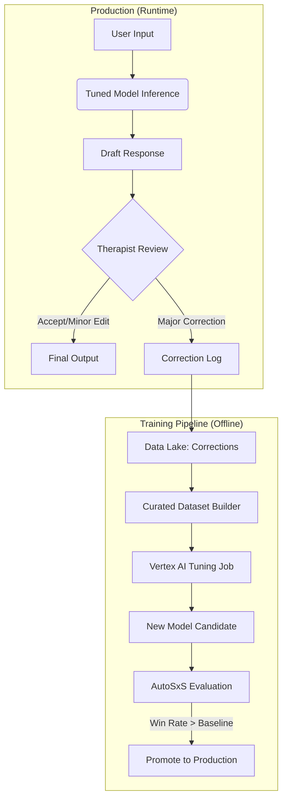

# ADR-017: Vertex AI Supervised Fine-Tuning (SFT) & Model Distillation

## Status

**Proposed** (v2.1 - Specialized Intelligence)

## Context

Actualmente (Enero 2026), AletheIA utiliza modelos generalistas "off-the-shelf" (Gemini 2.5 Pro/Ultra). Aunque son potentes, presentan ineficiencias críticas para una operación a escala:

| Problema | Impacto |
|----------|---------|
| **Exceso de Capacidad (Overkill)** | Usar un modelo de 1 trillón de parámetros para resumir una sesión (Unit: NOW) es ineficiente en costos y latencia |
| **Falta de "Tono Clínico"** | Los modelos genéricos tienden a ser "asistentes serviciales", pero Kura necesita "terapeutas analíticos". A menudo hay que "forcemodear" el comportamiento con prompts kilométricos |
| **Dependencia de Prompts** | La calidad depende de la ingeniería de prompts, que es frágil |

**La Solución:** Usar los datos generados por nuestra propia operación para entrenar (Fine-Tune) versiones pequeñas y rápidas (Gemini 2.5 Flash) que superen en rendimiento a los modelos gigantes en nuestras tareas específicas.

## Decision

Implementaremos un **Pipeline de Distilación y Fine-Tuning** para las AletheIA Units.
Transformaremos Kura OS de un consumidor de modelos a una **factoría de modelos clínicos**.

### Matriz de Especialización (2026 Target)

| Unit | Tarea Principal | Modelo Base (2026) | Modelo Tuned (Target) | Objetivo del Tuning |
|------|-----------------|--------------------|-----------------------|---------------------|
| **ORACLE** | Clinical Reasoning | Gemini 2.5 Flash | `kura-oracle-v2` | Adoptar terminología DSM-5 y formato de salida estructurado estricto |
| **SENTINEL** | Risk Detection | Gemini 2.5 Pro | `kura-sentinel-v2` | **Zero-tolerance** a falsos negativos. Ajuste de sensibilidad al riesgo |
| **PULSE** | Empathy Engine | Gemini 2.5 Flash | `kura-pulse-v2` | Modulación de tono (cálido pero profesional). Evitar "alucinaciones de consejo médico" |
| **NOW** | Summarization | Gemini 2.5 Flash | `kura-now-v2` | Compresión extrema de información sin perder datos clínicos clave |
| **SCAN** | OCR/Extraction | Gemini 2.5 Flash | `kura-scan-v2` | Mapeo perfecto a esquemas JSON de aseguradoras y sistemas de salud |

> [!IMPORTANT]
> **Cambio de Paradigma:** Pasamos de "Prompt Engineering" (decirle al modelo qué hacer en cada llamada) a "Model Training" (enseñarle al modelo cómo ser). Esto reduce los tokens de entrada en un 40-60%.

## Architecture

### 1. The Virtuous Cycle Engine

El sistema se retroalimenta. Cuanto más se usa Kura, mejores se vuelven los modelos.



### 2. Dataset Strategy (JSONL)

El formato de entrenamiento requiere pares `input` → `output` ideales.

**Ejemplo para Unit ORACLE (Clinical Analysis):**

```json
{"messages": [
  {"role": "system", "content": "Eres ORACLE. Tu objetivo es extraer sintomatología clínica basándote en la CIE-11."},
  {"role": "user", "content": "Paciente reporta dificultad para dormir, se despierta a las 3 AM y no puede volver a conciliar el sueño. Siente culpa excesiva por eventos de hace 10 años."},
  {"role": "model", "content": "{\"symptoms\": [{\"code\": \"MB23.1\", \"name\": \"Insomnio de mantenimiento\"}, {\"code\": \"MB24.C\", \"name\": \"Sentimientos de culpa excesiva\"}], \"risk_flag\": false}"}
]}
```

### 3. Training Service Implementation

Utilizamos el SDK de Vertex AI para lanzar trabajos de **LoRA (Low-Rank Adaptation)**, que es eficiente y rápido.

```python
# backend/app/services/training/fine_tuning_service.py

from google.cloud import aiplatform
from datetime import datetime

class KuraModelFactory:
    """
    Factoría de modelos clínicos especializados.
    Transforma Kura OS de consumidor a productor de modelos.
    """
    
    # Configuración base por unidad
    UNIT_CONFIGS = {
        "oracle": {
            "base_model": "gemini-2.5-flash-001",
            "epochs": 4,
            "adapter_size": 4,
        },
        "sentinel": {
            "base_model": "gemini-2.5-pro-001",  # Pro por criticidad
            "epochs": 6,
            "adapter_size": 8,
        },
        "pulse": {
            "base_model": "gemini-2.5-flash-001",
            "epochs": 4,
            "adapter_size": 4,
        },
        "now": {
            "base_model": "gemini-2.5-flash-001",
            "epochs": 3,
            "adapter_size": 4,
        },
        "scan": {
            "base_model": "gemini-2.5-flash-001",
            "epochs": 4,
            "adapter_size": 4,
        },
    }
    
    def train_new_unit_version(
        self, 
        unit_name: str, 
        dataset_uri: str,
    ) -> TuningJob:
        """
        Lanza un trabajo de fine-tuning en Vertex AI usando LoRA.
        
        Args:
            unit_name: Nombre de la unidad (oracle, sentinel, etc.)
            dataset_uri: URI del dataset en GCS (gs://...)
            
        Returns:
            TuningJob con el estado del entrenamiento
        """
        config = self.UNIT_CONFIGS[unit_name]
        
        aiplatform.init(project="kura-os-prod", location="europe-west4")
        
        # Naming: kura-{unit}-v{date}
        model_display_name = f"kura-{unit_name}-{datetime.now().strftime('%Y%m%d')}"
        
        tuning_job = aiplatform.sft.train(
            source_model=config["base_model"],
            train_dataset=dataset_uri,
            tuning_job_display_name=f"tuning-{model_display_name}",
            epochs=config["epochs"],
            learning_rate_multiplier=1.0,
            adapter_size=config["adapter_size"],  # LoRA rank
        )
        
        return tuning_job
    
    async def evaluate_and_promote(
        self,
        unit_name: str,
        candidate_model: str,
        baseline_model: str,
    ) -> PromotionResult:
        """
        Usa AutoSxS (ADR-015) para decidir promoción.
        """
        from .evaluation import AletheIAEvaluationService
        
        eval_service = AletheIAEvaluationService()
        result = await eval_service.run_evaluation(
            unit=unit_name,
            candidate_model=candidate_model,
            baseline_model=baseline_model,
        )
        
        if result.should_promote:
            await self._update_routing(unit_name, candidate_model)
            
        return PromotionResult(
            promoted=result.should_promote,
            win_rate=result.win_rate,
            model_name=candidate_model if result.should_promote else None,
        )
```

### 4. Data Harvesting (Correction Capture)

Capturamos las correcciones de terapeutas para el dataset de entrenamiento:

```python
# backend/app/services/training/correction_collector.py

class CorrectionCollector:
    """
    Captura correcciones de terapeutas para el dataset de fine-tuning.
    """
    
    async def log_correction(
        self,
        unit: str,
        original_input: str,
        ai_draft: str,
        therapist_correction: str,
        therapist_id: UUID,
    ) -> None:
        """
        Registra una corrección humana para entrenamiento futuro.
        
        Solo se guarda si la corrección es significativa (>10% diff).
        """
        # Calcular diferencia
        diff_ratio = self._calculate_diff(ai_draft, therapist_correction)
        
        if diff_ratio < 0.10:  # Menos del 10% de cambio = aceptación
            return
        
        # Sanitizar antes de guardar (ADR-016)
        sanitized_input = await self.privacy_shield.sanitize(original_input)
        sanitized_correction = await self.privacy_shield.sanitize(therapist_correction)
        
        # Guardar como JSONL
        correction = {
            "messages": [
                {"role": "system", "content": UNIT_SYSTEM_PROMPTS[unit]},
                {"role": "user", "content": sanitized_input},
                {"role": "model", "content": sanitized_correction},  # La versión humana
            ],
            "metadata": {
                "unit": unit,
                "therapist_id": str(therapist_id),
                "timestamp": datetime.utcnow().isoformat(),
                "diff_ratio": diff_ratio,
            }
        }
        
        await self._append_to_gcs(
            bucket="kura-training-data",
            path=f"corrections/{unit}/{datetime.now().strftime('%Y-%m')}.jsonl",
            data=correction,
        )
```

## Implementation Phases

### Phase 1: Data Harvesting (v1.5)
- [ ] Instrumentar frontend para capturar cada edición del terapeuta a respuestas IA
- [ ] Implementar `CorrectionCollector` con sanitización DLP
- [ ] Meta: Recolectar 500 ejemplos de "Correcciones Humanas" para ORACLE y NOW
- [ ] Infra: Bucket GCS `gs://kura-training-data/raw/`

### Phase 2: The Pilot (v1.6)
- [ ] Entrenar `kura-oracle-v1` (basado en Gemini 2.5 Flash) usando 500 ejemplos curados
- [ ] Validar con AutoSxS (ADR-015): `kura-oracle-v1` vs `Gemini 2.5 Pro` (Genérico)
- [ ] **Hipótesis:** El modelo pequeño entrenado (Flash Tuned) empatará o ganará al modelo gigante genérico (Pro), costando 10x menos

### Phase 3: Automated Factory (v2.0)
- [ ] Pipeline CI/CD automático
- [ ] **Trigger:** Cuando el dataset de una unidad acumula +100 nuevos ejemplos validados → Lanza re-entrenamiento automático → Evalúa → Despliega si mejora
- [ ] Dashboard de versiones y métricas de modelos

## Consequences

### Positive

| Beneficio | Impacto |
|-----------|---------|
| **Diferenciación Competitiva** | Nadie más tiene nuestros datos. GPT-5 puede salir mañana, pero no tendrá el entrenamiento específico de los terapeutas de Kura |
| **Economía de Escala** | Pasamos de pagar precios "Pro" a precios "Flash" con calidad superior |
| **Latencia** | Los modelos Flash responden en <500ms, vital para la experiencia de chat en tiempo real (PULSE) |
| **Propiedad Intelectual** | El valor de la empresa se traslada del código a los **pesos del modelo (Model Weights)** |

### Negative

| Riesgo | Descripción | Mitigación |
|--------|-------------|------------|
| **Catastrophic Forgetting** | Al enseñar al modelo mucha clínica, puede olvidar cómo hablar normal o razonar sobre cosas básicas | Mantener una mezcla de datos generales en el set de entrenamiento |
| **Drift** | Si los terapeutas empiezan a corregir mal, el modelo aprenderá a hacerlo mal | Revisión experta (Golden Gate) antes de añadir al dataset |
| **Overfitting** | Modelo muy especializado falla en edge cases | Validation holdout + AutoSxS continuo |

## Related Decisions

- **ADR-015 (AutoSxS):** Necesario para validar que el modelo entrenado no ha empeorado
- **ADR-016 (Shield/DLP):** CRÍTICO. Los datos de entrenamiento DEBEN estar sanitizados por DLP antes de entrar al pipeline de training, o el modelo "memorizará" nombres de pacientes reales
- **ADR-018 (Vector Search):** Los modelos tuned generan embeddings más relevantes para el dominio clínico

## References

- [Vertex AI Fine-Tuning with LoRA](https://cloud.google.com/vertex-ai/docs/generative-ai/models/tune-models)
- [Gemini 2.5 Tuning Best Practices](https://cloud.google.com/vertex-ai/docs/generative-ai/models/gemini-supervised-tuning)
- [CIE-11 Classification](https://icd.who.int/es)
- [DSM-5 Criteria](https://www.psychiatry.org/psychiatrists/practice/dsm)

---
*Authored by: Humbert Costas & Antigravity Agent*  
*Reviewed by: Arquitecto GEM*  
*Date: 2026-01-06*
