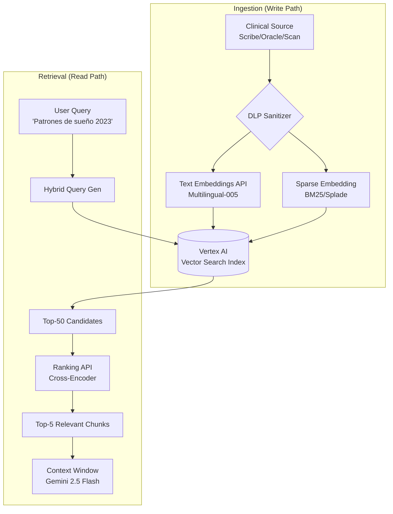

# ADR-018: RAG Engine - Vertex AI Vector Search & Grounding

## Status

**Proposed** (v2.0 - Clinical RAG Architecture)

## Context

### El Problema: "Amnesia Clínica"

Los LLMs, por muy grande que sea su ventana de contexto (Gemini 2.5 Pro admite 2M+ tokens), sufren de:

| Problema | Impacto |
|----------|---------|
| **Coste** | Pasar 10 años de historia clínica en cada prompt cuesta una fortuna |
| **Dilución de Atención** | En contextos masivos ("Lost in the Middle"), el modelo ignora detalles sutiles pero vitales del pasado |
| **Latencia** | Procesar 1 millón de tokens toma segundos valiosos |

Necesitamos un sistema que recupere **solo lo relevante** para el momento actual.

### La Solución: RAG (Retrieval Augmented Generation)

No basta con buscar vectores. En el dominio clínico necesitamos **Hybrid Search**:

| Tipo | Ejemplo Query | Comportamiento |
|------|---------------|----------------|
| **Vectorial (Semántica)** | "Paciente con ideación suicida recurrente" | Encuentra notas sobre "deseos de morir", "no despertar" |
| **Keyword (Léxica)** | "Alergia a Amoxicilina" | Debe encontrar exactamente esa cadena, no "alergia a medicamentos" |

> [!NOTE]
> **Analogía**: Sin RAG, AletheIA tiene "amnesia anterógrada" (como en la película *Memento*): es brillante en el momento, pero olvida todo al cerrar la sesión.

## Decision

Implementaremos un motor **RAG Clínico** basado en **Vertex AI Vector Search** con **Hybrid Search** y **Ranking API**.

Esto dotará a **ORACLE, NOW y PULSE** de una memoria episódica infinita y precisa.

## Architecture

### RAG Pipeline Completo



### Componentes Clave

| Componente | Función | Tecnología Google Cloud |
|------------|---------|-------------------------|
| **Embedding** | Convierte texto a vector denso (significado) | `text-embedding-005` (768 dim) |
| **Index** | Almacena y busca vectores a escala | **Vertex AI Vector Search** (Streaming Updates) |
| **Hybrid Search** | Combina vectores + palabras clave exactas | Vertex AI Hybrid Search |
| **Reranker** | Re-ordena los resultados por calidad real | **Vertex AI Ranking API** |
| **Grounding** | Conecta el LLM con los datos recuperados | Vertex AI Grounding Service |

## Implementation Details

### 1. Hybrid Search Indexing

Para soportar búsquedas precisas (medicamentos) y semánticas (emociones), indexamos ambos aspectos.

```json
{
  "id": "session_2023_01_15_chunk_4",
  "embedding": [0.012, -0.934, ...],
  "restricts": [
    {"namespace": "patient_id", "allow": ["uuid-123"]}, 
    {"namespace": "org_id", "allow": ["uuid-org"]},
    {"namespace": "doc_type", "allow": ["session"]}
  ],
  "numeric_restricts": [
    {"namespace": "timestamp", "value_int": 1673740800}
  ],
  "content": "El paciente menciona efectos adversos con Sertralina..."
}
```

### 2. The Retrieval Service (Hybrid + Rerank)

Este es el código que hace la magia. No solo recupera, sino que **refina**.

```python
# backend/app/services/memory/rag_service.py

from google.cloud import aiplatform
from vertexai.preview.language_models import TextEmbeddingModel
from vertexai.preview.ranking import RankingModel

class ClinicalRAGEngine:
    """
    Motor RAG Clínico con Hybrid Search y Reranking.
    Proporciona memoria a largo plazo para ORACLE, NOW y PULSE.
    """
    
    def __init__(self):
        self.vector_search = aiplatform.MatchingEngineIndexEndpoint("kura-memory-prod")
        self.embedder = TextEmbeddingModel.from_pretrained("text-embedding-005")
        self.ranker = RankingModel.from_pretrained("semantic-ranker-512")
        
    async def retrieve_clinical_context(
        self, 
        query: str, 
        patient_id: str,
        organization_id: str,
        limit: int = 5,
    ) -> RetrievalResult:
        """
        Recupera contexto clínico relevante con Hybrid Search + Reranking.
        
        Args:
            query: Texto de búsqueda (fragmento de sesión, pregunta, etc.)
            patient_id: Filtro OBLIGATORIO por paciente
            organization_id: Filtro OBLIGATORIO por organización (multi-tenancy)
            limit: Número de chunks a retornar (default: 5)
            
        Returns:
            RetrievalResult con chunks ordenados por relevancia
        """
        # 1. Generar Embedding de la consulta
        query_vec = self.embedder.get_embeddings([query])[0].values
        
        # 2. Hybrid Retrieval (Busca 50 candidatos crudos)
        # Recuperamos más de los necesarios para luego filtrar con el Reranker
        neighbors = await self.vector_search.find_neighbors(
            queries=[query_vec],
            num_neighbors=50,  # Wide net
            filter=[
                {"namespace": "patient_id", "allow": [patient_id]},
                {"namespace": "org_id", "allow": [organization_id]},
            ]
        )
        
        # 3. Extraer textos de los candidatos
        candidates = [n.entity.content for n in neighbors[0]]
        
        if not candidates:
            return RetrievalResult(chunks=[], query=query)
        
        # 4. Reranking (El paso de Calidad)
        # El Reranker lee la consulta y el candidato y asigna un score de relevancia real.
        # Esto elimina "falsos positivos" vectoriales.
        ranked_results = self.ranker.rank(
            query=query,
            documents=candidates,
            top_k=limit,
        )
        
        # 5. Construir resultado estructurado
        chunks = [
            RetrievedChunk(
                content=r.document.content,
                score=r.score,
                metadata=r.document.metadata,
                date=r.document.metadata.get("date"),
            )
            for r in ranked_results
        ]
        
        return RetrievalResult(chunks=chunks, query=query)
    
    def format_for_llm(self, result: RetrievalResult) -> str:
        """
        Formatea los chunks recuperados para inyectar en el prompt del LLM.
        """
        if not result.chunks:
            return "[No se encontró historial relevante]"
            
        context_block = "\n".join([
            f"- [Fecha: {chunk.date}] {chunk.content}" 
            for chunk in result.chunks
        ])
        
        return f"""## Contexto Histórico Relevante
{context_block}
"""
```

### 3. Streaming Ingestion

A diferencia de los índices antiguos que se actualizaban cada hora, usaremos **Streaming Update**.

| Caso de Uso | Comportamiento |
|-------------|----------------|
| Paciente dice algo en el minuto 10 de la sesión | Vector disponible para búsqueda segundos después |
| PULSE (Chat) necesita recordar en el minuto 15 | Acceso inmediato al contexto recién indexado |

```python
# backend/app/services/memory/ingestion_service.py

class StreamingIngestionService:
    """
    Servicio de ingestión en tiempo real para RAG.
    """
    
    async def index_clinical_document(
        self,
        document: ClinicalDocument,
    ) -> IndexResult:
        """
        Indexa un documento clínico en tiempo real (streaming).
        
        El documento estará disponible para búsqueda en ~2 segundos.
        """
        # 1. Sanitizar con DLP (ADR-016)
        sanitized_content = await self.dlp_shield.sanitize(document.content)
        
        # 2. Generar embedding
        embedding = self.embedder.get_embeddings([sanitized_content])[0].values
        
        # 3. Construir datapoint con metadata
        datapoint = {
            "id": str(document.id),
            "embedding": embedding,
            "content": sanitized_content,
            "restricts": [
                {"namespace": "patient_id", "allow": [str(document.patient_id)]},
                {"namespace": "org_id", "allow": [str(document.organization_id)]},
                {"namespace": "doc_type", "allow": [document.doc_type]},
            ],
            "numeric_restricts": [
                {"namespace": "timestamp", "value_int": int(document.created_at.timestamp())},
            ],
        }
        
        # 4. Streaming upsert (disponible en ~2s)
        await self.index.upsert_datapoints_async([datapoint])
        
        return IndexResult(
            indexed=True,
            vector_id=str(document.id),
            latency_ms=self._measure_latency(),
        )
```

### 4. Enriched ORACLE with RAG

ORACLE enriquecido con memoria a largo plazo:

```python
# backend/app/services/aletheia/oracle_with_memory.py

class EnrichedOracleService:
    """
    ORACLE enriquecido con RAG Engine.
    Analiza sesiones con contexto histórico recuperado automáticamente.
    """
    
    def __init__(self):
        self.rag_engine = ClinicalRAGEngine()
        self.oracle = OracleUnit()
    
    async def analyze_with_memory(
        self,
        current_session: str,
        patient_id: UUID,
        organization_id: UUID,
    ) -> EnrichedAnalysis:
        """
        Analiza la sesión actual con contexto histórico recuperado.
        """
        # 1. Recuperar contexto relevante
        retrieval = await self.rag_engine.retrieve_clinical_context(
            query=current_session,
            patient_id=str(patient_id),
            organization_id=str(organization_id),
            limit=5,
        )
        
        # 2. Construir prompt enriquecido
        context_block = self.rag_engine.format_for_llm(retrieval)
        
        enriched_prompt = f"""
## Sesión Actual
{current_session}

{context_block}

## Instrucciones
Analiza la sesión actual considerando el contexto histórico.
Identifica patrones recurrentes, progreso terapéutico y conexiones
con experiencias pasadas del paciente.
"""
        
        # 3. Ejecutar ORACLE con contexto enriquecido
        analysis = await self.oracle.analyze(enriched_prompt)
        
        return EnrichedAnalysis(
            analysis=analysis,
            sources=[c.to_source() for c in retrieval.chunks],
            retrieval_score=retrieval.avg_score,
        )
```

## Implementation Phases

### Phase 1: The Core (v1.6)
- [ ] Desplegar Index Endpoint en `europe-west4` (Low latency)
- [ ] Pipeline de ingestión para **ORACLE** (Análisis históricos)
- [ ] Implementar **Ranking API** (mejora la precisión un 40%)
- [ ] Filtros obligatorios `patient_id` + `org_id` en todas las queries

### Phase 2: Real-time Memory (v1.8)
- [ ] Conectar **PULSE** (Chat) a Streaming Ingestion
- [ ] Implementar "Short-term to Long-term consolidation" (Resumir el chat del día y vectorizarlo)
- [ ] Dashboard de métricas de retrieval quality

### Phase 3: Cross-Modal RAG (Future)
- [ ] Indexar **Audio** directamente (usando Gemini Multimodal Embeddings) para buscar por tono de voz, no solo texto transcrito
- [ ] Búsqueda temporal avanzada ("documentos de hace 6 meses")

## Consequences

### Positive

| Beneficio | Impacto |
|-----------|---------|
| **Precisión Clínica** | Hybrid Search encuentra "Paroxetina" (keyword) y "tristeza profunda" (vector) simultáneamente |
| **Reducción de Alucinaciones** | El modelo responde *basado en* los documentos recuperados (Grounding), no en su imaginación |
| **Cost Efficiency** | Recuperamos pequeños fragmentos de texto, evitando llenar la ventana de contexto de 2M tokens ($$$) |
| **Memoria Infinita** | Acceso a años de historial sin límite de contexto del LLM |

### Negative

| Riesgo | Descripción | Mitigación |
|--------|-------------|------------|
| **Complejidad de Infraestructura** | Mantener sincronizado el índice vectorial con la base de datos SQL (Source of Truth) es difícil | Change Data Capture (CDC) pipelines |
| **Latencia Reranking** | El paso de Reranker añade ~200ms. Es aceptable para ORACLE, crítico para PULSE | Usar Reranker solo en análisis complejos, no en cada turno de chat |
| **Costo de Hosting** | Matching Engine endpoint tiene costo fijo (~$200/mes mínimo) | Shared endpoints por región |

## Security (HIPAA/GDPR)

> [!CAUTION]
> **Tenant Isolation es INVIOLABLE**: El filtro `patient_id` + `org_id` en Vector Search debe aplicarse a nivel de API, hardcodeado en el backend, NUNCA confiando en el frontend.

```python
# OBLIGATORIO en TODAS las queries
filter=[
    {"namespace": "patient_id", "allow": [patient_id]},      # REQUIRED
    {"namespace": "org_id", "allow": [organization_id]},     # REQUIRED
]
```

### DLP Integration (ADR-016)
Los documentos se indexan **después** de pasar por el pipeline de sanitización DLP. Los vectores nunca contienen PII en texto claro.

## Related Decisions

- **ADR-015 (AutoSxS):** Puede evaluar la calidad de retrieval
- **ADR-016 (Shield/DLP):** Sanitiza contenido antes de indexar
- **ADR-017 (Fine-Tuning):** Los modelos tuned generan mejores análisis con el contexto recuperado
- **Taxonomy v1.3:** ORACLE, NOW y PULSE consumen esta memoria

## References

- [Vertex AI Vector Search](https://cloud.google.com/vertex-ai/docs/vector-search/overview)
- [Vertex AI Ranking API](https://cloud.google.com/vertex-ai/docs/generative-ai/ranking/overview)
- [Text Embeddings API](https://cloud.google.com/vertex-ai/docs/generative-ai/embeddings/get-text-embeddings)
- [RAG Best Practices](https://cloud.google.com/vertex-ai/docs/generative-ai/rag-overview)

---
*Authored by: Humbert Costas & Antigravity Agent*  
*Reviewed by: Arquitecto GEM*  
*Date: 2026-01-06*
