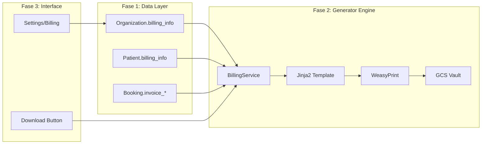

# ADR-027: Sovereign Billing (Facturación Nativa)

> **Status**: PROPOSED  
> **Date**: 2026-01-09  
> **Author**: Architect GEM (adaptado)  
> **Relates To**: ADR-023 (Insurance Billing), GROW pillar

## Contexto

Los terapeutas necesitan generar facturas básicas para las reservas pagadas. Hasta ahora no existe funcionalidad nativa de facturación. Stripe genera recibos, pero no facturas fiscales válidas en España/EU.

## Decisión

Implementar **Sovereign Billing**: un módulo de facturación nativa en tres fases que permite a cada organización configurar sus datos fiscales y generar PDFs profesionales almacenados en el Vault privado.

## Arquitectura: 3 Fases



---

## Fase 1: Data Layer (Cimientos de Datos)

### Objetivo
Preparar la DB para almacenar datos fiscales y la lógica de numeración secuencial.

### Modelo `Organization` (Emisor)

| Campo | Tipo | Descripción |
|-------|------|-------------|
| `billing_info` | JSONB | Datos fiscales (ver schema abajo) |
| `invoice_sequence_counter` | Integer | Contador atómico para numeración |
| `invoice_prefix` | String | Prefijo de factura (default: `"INV-{YYYY}-"`) |

**Schema `billing_info` (Organización)**:
```python
class OrganizationBillingInfo(BaseModel):
    tax_id: str  # CIF/NIF
    legal_name: str
    address: dict  # {line1, city, country, zip}
    footer_text: Optional[str]  # Notas legales ("Exento de IVA...")
```

> [!NOTE]
> Usamos JSONB para flexibilidad internacional. Un cliente en Londres tiene formato diferente a uno en Madrid.

### Modelo `Patient` (Receptor)

| Campo | Tipo | Descripción |
|-------|------|-------------|
| `billing_info` | JSONB | Datos fiscales del cliente (opcional) |

Si está vacío, se usará nombre y email del perfil por defecto.

### Modelo `Booking` (El Documento)

| Campo | Tipo | Descripción |
|-------|------|-------------|
| `invoice_number` | String (unique, nullable) | Solo existe si se generó factura |
| `invoice_pdf_path` | String (nullable) | Ruta GCS: `gs://kura-production-vault/billing/...` |
| `billing_snapshot` | JSONB | **Copia inmutable** de datos fiscales al emitir |

> [!IMPORTANT]
> `billing_snapshot` congela los datos fiscales. Si la empresa cambia de dirección mañana, las facturas antiguas NO deben cambiar.

### Migración Alembic

**Archivo**: `alembic/versions/xxx_add_billing_fields.py`

```python
# Columnas a añadir:
# - organizations: billing_info, invoice_sequence_counter, invoice_prefix
# - patients: billing_info
# - bookings: invoice_number, invoice_pdf_path, billing_snapshot
```

---

## Fase 2: Generator Engine (Motor de Generación)

### Objetivo
Crear el servicio que renderiza HTML → PDF y almacena en el Vault.

### Dependencias

```txt
# requirements.txt
weasyprint>=60.0
jinja2>=3.1.0
```

### Template System

**Archivo**: `backend/app/templates/billing/invoice_clean.html`

- Diseño minimalista y profesional
- CSS clásico inline (Tailwind no funciona bien en WeasyPrint)
- Variables Jinja2: `{{ org.legal_name }}`, `{{ patient.name }}`, `{{ booking.price_total }}`, etc.

### BillingService

**Archivo**: `backend/app/services/billing_service.py`

```python
class BillingService:
    async def generate_invoice(
        self, 
        booking_id: UUID, 
        user: User,
        db: AsyncSession
    ) -> InvoiceResult:
        """
        1. Obtener Booking, Patient, Organization
        2. Verificar si ya existe factura (idempotencia)
        3. Generar invoice_number atómicamente
        4. Crear billing_snapshot inmutable
        5. Renderizar HTML con Jinja2
        6. Generar PDF con WeasyPrint
        7. Subir a GCS Vault (bucket privado)
        8. Guardar path y número en DB
        """
        
    async def get_download_url(
        self, 
        booking_id: UUID
    ) -> str:
        """Generar Signed URL temporal (15 min)"""
```

> [!CAUTION]
> Las facturas contienen PII. DEBEN ir al bucket privado `kura-production-vault`, NO al bucket público de medios.

### Numeración Atómica

```python
# Usar SELECT FOR UPDATE para evitar race conditions
async def get_next_invoice_number(org_id: UUID, db: AsyncSession) -> str:
    result = await db.execute(
        select(Organization)
        .where(Organization.id == org_id)
        .with_for_update()
    )
    org = result.scalar_one()
    org.invoice_sequence_counter += 1
    await db.commit()
    
    year = datetime.now().year
    return f"{org.invoice_prefix.replace('{YYYY}', str(year))}{org.invoice_sequence_counter:05d}"
```

### API Endpoints

**Router**: `backend/app/api/v1/grow/billing.py`

| Método | Endpoint | Descripción |
|--------|----------|-------------|
| POST | `/grow/billing/bookings/{id}/generate` | Generar factura (manual o post-pago) |
| GET | `/grow/billing/bookings/{id}/download` | Redirect a Signed URL |

---

## Fase 3: Interface (UI)

### Objetivo
Configuración en Settings y botón de descarga en Booking.

### Settings Page

**Archivo**: `apps/platform/app/[locale]/(dashboard)/settings/billing/page.tsx`

Formulario `BillingSettingsForm`:
- Legal Name (Razón Social)
- Tax ID (CIF/NIF) - **Obligatorio si se activa facturación**
- Address Fields (Calle, Ciudad, CP, País)
- Invoice Prefix (editable, default `INV-2026-`)
- Footer Text (textarea para notas legales)

**API**: `PATCH /api/v1/organizations/me`

### Booking Detail

**Archivo**: `apps/platform/app/[locale]/(dashboard)/bookings/[id]/page.tsx`

Lógica del botón "Factura":

| Estado | Acción |
|--------|--------|
| `invoice_pdf_path` existe | Botón "Descargar Factura" → `window.open(url)` |
| No existe + PAGADA | Botón "Generar Factura" → POST + descarga |
| No pagada | Botón deshabilitado |

### Patient Profile (Quick Win)

Permitir editar `billing_info` del paciente para facturas personalizadas.

---

## Consideraciones Técnicas

### Seguridad
- PDFs en bucket privado con Signed URLs
- Acceso restringido a la organización propietaria
- Snapshot inmutable para auditoría fiscal

### Multi-tenancy
- `invoice_sequence_counter` por organización (no global)
- Cada org tiene su propia secuencia de facturas

### Idempotencia
- Si `invoice_number` ya existe, devolver existente
- NUNCA regenerar ni incrementar contador

### Compliance
- Footer configurable para requisitos legales locales
- Estructura JSONB permite adaptarse a diferentes países

---

## Implementación

### Orden de Ejecución

1. **Fase 1**: Modelos + Migración Alembic
2. **Fase 2**: `BillingService` + Template + Endpoints
3. **Fase 3**: UI Settings + Botón en Bookings

### Estimación

| Fase | Esfuerzo |
|------|----------|
| Fase 1 | 2-3 horas |
| Fase 2 | 4-5 horas |
| Fase 3 | 3-4 horas |

**Total**: ~10-12 horas de desarrollo

---

## Referencias

- [WeasyPrint Docs](https://weasyprint.org/)
- [GCS Signed URLs](https://cloud.google.com/storage/docs/access-control/signed-urls)
- ADR-023: Insurance Billing (alcance diferente - aseguradoras)
