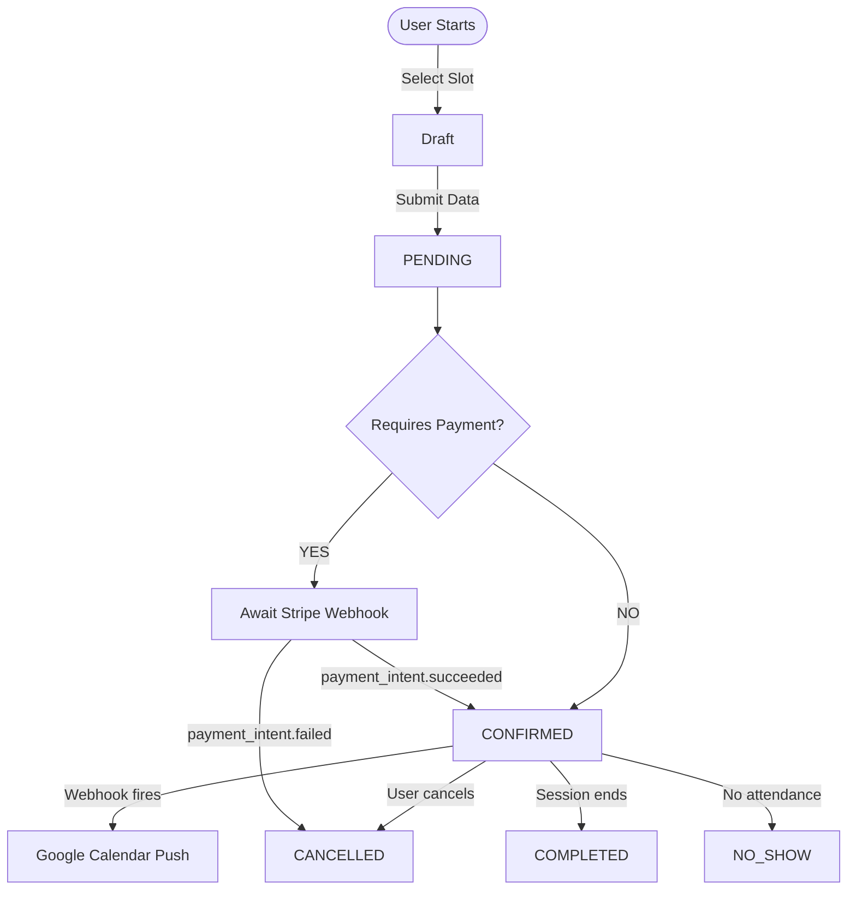

# The Box Office (Booking Engine)

> **Status**: Production (v1.1.20)  
> **Scope**: Scheduling, Payments, Calendar Sync  
> **Last Updated**: 2026-01-03

---

## 1. Overview

The **Box Office** is the central nervous system for scheduling. It orchestrates three distinct subsystems into a unified transaction:

1. **Inventory**: Availability management (Slots & Schedules)
2. **Transaction**: Financial capture (Stripe Connect or Free)
3. **Synchronization**: External calendar propagation (Google Calendar)

**Core Principle**: The `Booking` entity is the sovereign record. Payments and Calendar Events are *side effects* of a valid booking.

```
┌─────────────────────────────────────────────────────────────────┐
│                     BOX OFFICE SYSTEM                           │
├──────────────────┬─────────────────────┬────────────────────────┤
│   AVAILABILITY   │   TRANSACTION       │   SYNCHRONIZATION      │
├──────────────────┼─────────────────────┼────────────────────────┤
│ • SlotService    │ • PaymentIntent     │ • GoogleCalendarService│
│ • TimeOff        │ • Stripe Connect    │ • Event Push           │
│ • Schedules      │ • Commission Split  │ • Busy-time Blocking   │
└──────────────────┴─────────────────────┴────────────────────────┘
```

---

## 2. Public Booking Wizard

**Location**: `apps/platform/app/[locale]/book/[therapist_id]/`  
**State Management**: `useBookingStore` (Persistent, see `state-management.md`)

### The 4-Step Flow

| Step | Component | Logic |
|:---|:---|:---|
| 1. Service | `StepService.tsx` | Fetches active services (`is_active=True`) linked to therapist |
| 2. Slot | `StepSlot.tsx` | Timezone-aware slots via `Intl.DateTimeFormat()`. Backend anti-collision. |
| 3. Details | `StepForm.tsx` | Collects Name, Email, Phone. Future: `FormTemplate` injection (v1.2) |
| 4. Payment | `StepPayment.tsx` | Bifurcation based on `Service.price > 0 && org.stripe_enabled` |

### The Bifurcation (Step 4)

```python
if service.price > 0 AND org.stripe_connect_enabled:
    render(StepPayment)  # Stripe Elements
else:
    render(ConfirmButton)  # Direct confirmation
```

---

## 3. Transaction Engine & Lifecycle

### Status Enum
**File**: `backend/app/db/models.py` (line 180)

```python
class BookingStatus(str, Enum):
    PENDING = "PENDING"      # Created, awaiting payment
    CONFIRMED = "CONFIRMED"  # Paid and scheduled
    CANCELLED = "CANCELLED"  # Cancelled by patient or therapist
    COMPLETED = "COMPLETED"  # Session took place
    NO_SHOW = "NO_SHOW"      # Patient didn't attend
```

### Lifecycle Diagram



### Side Effects on CONFIRMED

**File**: `backend/app/api/v1/payments.py` (webhook handler)

1. `booking.status = BookingStatus.CONFIRMED`
2. Fire `PAYMENT_SUCCEEDED` automation event
3. Send confirmation email via Brevo
4. Create Google Calendar event (if connected)

---

## 4. Slot Generation Engine

**File**: `backend/app/services/slots.py`

### Core Formula

```
Available Slots = (AvailabilityBlocks + SpecificAvailability)
                  - TimeOffs
                  - ExistingBookings (PENDING | CONFIRMED)
                  - GoogleCalendar BusyTimes
```

### `SlotService.get_available_slots()`

```python
async def get_available_slots(
    therapist_id, service_id, start_date, end_date
) -> list[TimeSlot]:
    # 1. Get recurring AvailabilityBlocks for schedule
    # 2. Add SpecificAvailability (global + schedule-specific)
    # 3. Subtract TimeOffs
    # 4. Subtract existing bookings (respect capacity)
    # 5. Subtract Google Calendar busy times
    # 6. Filter past slots
```

### Anti-Collision: Transactional Locking

**Problema**: Previene **dobles bookings** cuando dos usuarios intentan reservar el último slot disponible simultáneamente (condición de carrera "Phantom Read").

**Mecanismo**: Bloqueo pesimista de base de datos que serializa las reservas por terapeuta.

**File**: `backend/app/api/v1/public_booking.py` (lines 320-350)

```python
# 1. Lock the therapist record to serialize concurrent requests
await db.execute(
    select(User.id)
    .where(User.id == therapist_id)
    .with_for_update()  # PostgreSQL: SELECT FOR UPDATE
)

# 2. Count overlapping bookings atomically
overlapping = await db.execute(
    select(func.count(Booking.id)).where(
        Booking.therapist_id == therapist_id,
        Booking.start_time < slot_end,
        Booking.end_time > slot_start,
        Booking.status.in_([PENDING, CONFIRMED]),
    )
)

# 3. Verify capacity
if overlapping >= service.capacity:
    raise HTTPException(409, "Slot fully booked")
```

**Resultado**: La segunda petición espera a que la primera complete. Si el slot se llenó, recibe **HTTP 409 Conflict**. Garantiza 0% de overbooking.

---

## 5. Payment System

### Stripe Connect Integration
**File**: `backend/app/services/stripe_service.py`

| Tier | Commission Rate | 
|:---|---:|
| `BUILDER` (Free) | 5% |
| `PRO` | 3% |
| `CENTER` | 2% |

### PaymentIntent Creation
**File**: `backend/app/api/v1/payments.py`

```python
# With Stripe Connect (production)
payment_intent = stripe.PaymentIntent.create(
    amount=amount_cents,
    currency=currency,
    transfer_data={"destination": org.stripe_connect_id},
    application_fee_amount=application_fee,  # Our commission
)

# Dev Bypass (sk_test_* mode)
# Direct payment without Connect split
```

### Webhook Events Handled

| Event | Action |
|:---|:---|
| `payment_intent.succeeded` | `PENDING → CONFIRMED`, send email, create GCal event |
| `payment_intent.payment_failed` | `PENDING → CANCELLED`, fire automation |

---

## 6. Lead → Patient Auto-Conversion

**File**: `backend/app/api/v1/public_booking.py` (lines 220-268)

When a booking is created, if the email matches an existing Lead:

```python
if lead := await find_lead_by_email(email):
    # Memory Handover: Preserve lead's history
    patient = Patient(
        profile_data={
            "referral_source": lead.source,
            "initial_notes": lead.notes,
            "converted_from_lead": str(lead.id),
            "auto_converted_via": "public_booking",
        }
    )
    lead.status = LeadStatus.CONVERTED
    lead.converted_patient_id = patient.id
```

---

## 7. Key Files Reference

| Component | File |
|:---|:---|
| Public API | `backend/app/api/v1/public_booking.py` |
| Slot Generator | `backend/app/services/slots.py` |
| Payment Handler | `backend/app/api/v1/payments.py` |
| Stripe Service | `backend/app/services/stripe_service.py` |
| GCal Integration | `backend/app/services/google_calendar.py` |
| Booking Model | `backend/app/db/models.py` (Booking, BookingStatus) |
| Frontend Store | `apps/platform/stores/booking-store.ts` |
| Wizard Component | `apps/platform/components/booking/BookingWizard.tsx` |
