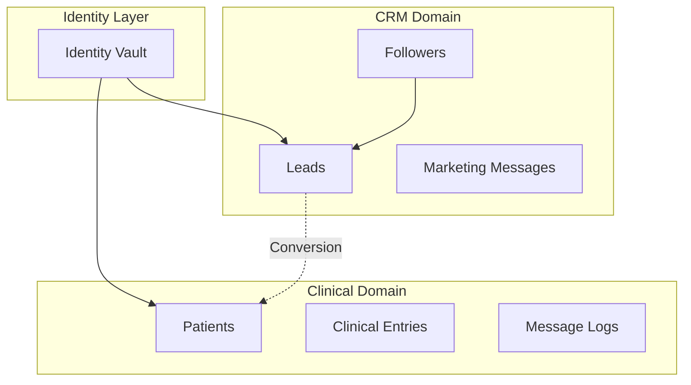
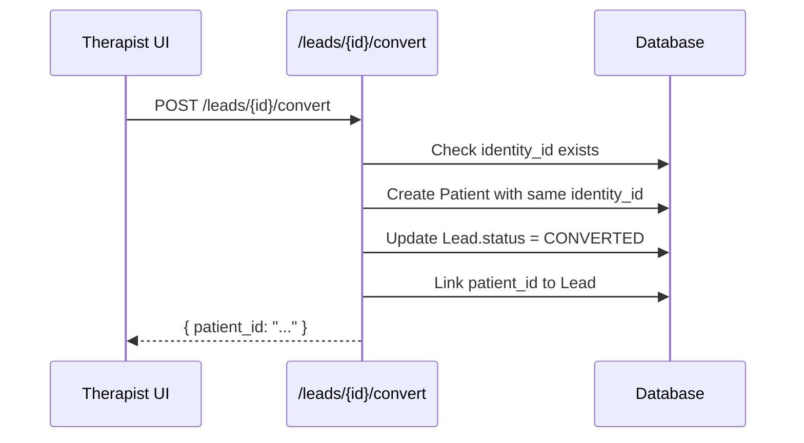

# 🔐 Identity Vault & CRM Architecture - Technical Documentation

> **Version:** v1.7.6 | **Last Updated:** 2026-01-12

## Overview

The **Identity Vault** is the foundational layer that enables Kura OS to maintain HIPAA-compliant separation between CRM (marketing) and Clinical (PHI) data while preserving unified contact identity.



---

## 1. The UUID Strategy

### Core Principle
Every person who interacts with Kura OS gets a single, permanent `identity_id` that persists across all their entity representations.

### Identity Flow

```
Phone/Email arrives (e.g., from WhatsApp)
         │
         ▼
    ┌─────────────┐
    │ Lookup UUID │ ◄─── Check IdentityVault by phone/email
    └─────────────┘
         │
    ┌────┴────┐
    │ Found?  │
    └────┬────┘
    No   │   Yes
    │    │    │
    ▼    │    ▼
Create   │  Return existing
new UUID │  identity_id
    │    │
    └────┴───► Use identity_id for all operations
```

### IdentityVault Table

| Column | Type | Description |
|--------|------|-------------|
| `id` | UUID | **The universal identity_id** |
| `primary_email` | String | Unique (nullable) |
| `primary_phone` | String | Unique (normalized with +) |
| `created_at` | DateTime | First contact |
| `organization_id` | FK | Multi-tenant isolation |

---

## 2. Entity Types & Data Separation

### The Three Entities

| Entity | Domain | Contains PHI? | Deletion Policy |
|--------|--------|---------------|-----------------|
| **Lead** | CRM | ❌ No | Hard delete allowed |
| **Patient** | Clinical | ✅ Yes | Soft delete only (`is_active=false`) |
| **Follower** | Marketing | ❌ No | Hard delete allowed |

### Lead (CRM)

```python
class Lead(Base):
    id: UUID
    identity_id: UUID  # Links to IdentityVault
    organization_id: UUID
    
    # Contact info (not PHI)
    first_name: str
    last_name: str
    email: str
    phone: str
    
    # Funnel tracking
    status: LeadStatus  # NEW → CONTACTED → QUALIFIED → CONVERTED
    source: str  # "INSTAGRAM", "BOOKING", "MANUAL"
    
    # Marketing allowed
    notes: str  # Sales notes, not clinical
```

### Patient (Clinical)

```python
class Patient(Base):
    id: UUID
    identity_id: UUID  # Links to IdentityVault
    organization_id: UUID
    
    # Demographics
    first_name: str
    last_name: str
    date_of_birth: date  # PHI!
    
    # Clinical
    clinical_notes: JSONB  # PHI!
    journey_status: JSONB
    privacy_tier: PrivacyTier  # GHOST, STANDARD, LEGACY
    
    # Soft delete
    is_active: bool = True
```

---

## 3. Lead → Patient Conversion

### The Critical Moment
Conversion is a **one-way** operation that creates clinical context.



### Key Guarantees

1. **Identity Preserved:** Both Lead and Patient share `identity_id`
2. **Messages Transfer:** MessageLogs linked by `identity_id` remain accessible
3. **CRM Data Stays:** Lead record remains for funnel analytics
4. **Clinical Created:** New Patient record with fresh clinical context

### Code Reference
**File:** `backend/app/services/lead_service.py`

```python
async def convert_lead_to_patient(lead_id: UUID, db: Session) -> Patient:
    lead = await get_lead(lead_id, db)
    
    # Create patient with same identity
    patient = Patient(
        identity_id=lead.identity_id,  # ← Critical link
        organization_id=lead.organization_id,
        first_name=lead.first_name,
        last_name=lead.last_name,
        phone=lead.phone,
        email=lead.email,
    )
    
    # Update lead status
    lead.status = LeadStatus.CONVERTED
    lead.patient_id = patient.id
    
    return patient
```

---

## 4. HIPAA-Compliant Data Flow

### Separation Rules

| Operation | CRM (Leads) | Clinical (Patients) |
|-----------|-------------|---------------------|
| View contact info | ✅ All roles | ✅ All roles |
| View marketing notes | ✅ All roles | ❌ N/A |
| View clinical notes | ❌ N/A | ✅ THERAPIST+ |
| Export data | ✅ Allowed | ⚠️ Audit logged |
| Delete record | ✅ Hard delete | ❌ Soft delete only |
| API access | `/leads/*` | `/patients/*` |

### Role-Based Access

| Role | Leads | Patients (PHI) |
|------|-------|----------------|
| ASSISTANT | Full CRUD | Read name only |
| THERAPIST | Full CRUD | Full CRUD |
| ADMIN | Full CRUD | Full CRUD |

---

## 5. MessageLog Routing

### The Problem
When a WhatsApp message arrives, how do we know where to store it?

### The Solution: Identity-Anchored Routing

```python
async def route_message(phone: str, content: str):
    # Find identity by phone
    identity = await IdentityVault.get_by_phone(phone)
    
    if not identity:
        # Create new identity + Lead
        identity = await create_identity(phone)
        lead = await create_lead(identity_id=identity.id)
    
    # Check if converted to patient
    patient = await Patient.query.filter_by(identity_id=identity.id).first()
    lead = await Lead.query.filter_by(identity_id=identity.id).first()
    
    # Create MessageLog with appropriate links
    message = MessageLog(
        identity_id=identity.id,
        patient_id=patient.id if patient else None,
        lead_id=lead.id if lead and not patient else None,
        content=content,
    )
```

### Query Patterns

**Get all messages for a contact (regardless of status):**
```sql
SELECT * FROM message_logs 
WHERE identity_id = :uuid
ORDER BY timestamp DESC;
```

**Get clinical messages only:**
```sql
SELECT * FROM message_logs 
WHERE patient_id = :uuid
ORDER BY timestamp DESC;
```

---

## 6. Multi-Tenant Isolation

### The Rule
Every query MUST filter by `organization_id`.

### Implementation Pattern

```python
# ✅ Correct - Always filter by org
patients = db.query(Patient).filter(
    Patient.organization_id == current_user.organization_id
).all()

# ❌ NEVER do this - Exposes other orgs
patients = db.query(Patient).all()
```

### Database Constraint
```sql
-- All tables have org isolation
ALTER TABLE patients 
    ADD CONSTRAINT patients_org_fk 
    FOREIGN KEY (organization_id) 
    REFERENCES organizations(id);

-- Index for performance
CREATE INDEX idx_patients_org ON patients(organization_id);
```

---

## 7. API Endpoints

### Identity Check
```
GET /contacts/check?phone=+34612345678
→ { found: true, identity_id: "...", linked_entity: { type: "patient", id: "..." } }
```

### Lead CRUD
```
GET    /leads/              # List leads
POST   /leads/              # Create lead
GET    /leads/{id}          # Get lead
PATCH  /leads/{id}          # Update lead
POST   /leads/{id}/convert  # Convert to patient
DELETE /leads/{id}          # Hard delete
```

### Patient CRUD
```
GET    /patients/           # List patients
POST   /patients/           # Create patient
GET    /patients/{id}       # Get patient
PUT    /patients/{id}       # Update patient
DELETE /patients/{id}       # Soft delete (is_active=false)
```

---

## 8. Best Practices

### For New Features

1. **Always use identity_id** for cross-entity references
2. **Never store PHI in Lead** table
3. **Always soft-delete Patients**
4. **Filter by organization_id** in every query
5. **Use terminology hook** (`useTerminology()`) for patient/client labels

### Debug Queries

```sql
-- Find all entities for a phone number
SELECT 
    iv.id as identity_id,
    l.id as lead_id, l.status as lead_status,
    p.id as patient_id, p.is_active as patient_active
FROM identity_vault iv
LEFT JOIN leads l ON l.identity_id = iv.id
LEFT JOIN patients p ON p.identity_id = iv.id
WHERE iv.primary_phone = '+34612345678';
```

---

## References

- [WhatsApp Integration Guide](./whatsapp-monitoring.md)
- [ADR-010: Clean Room Strategy](../architecture/decisions/ADR-010-clean-room-strategy.md)
- [Data Privacy Standards](../standards/data-privacy.md)
