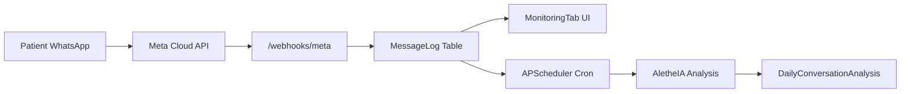
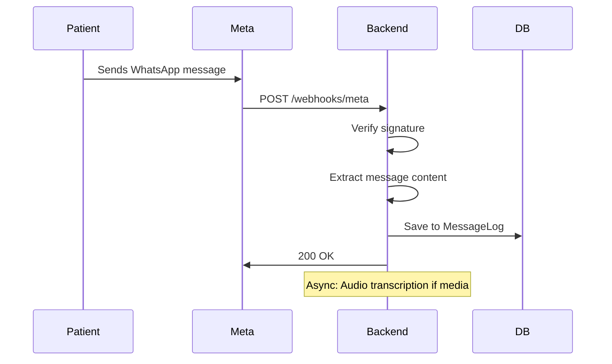

# 📊 WhatsApp & Meta Cloud API Integration - Technical Documentation

> **Version:** v1.7.6 | **Last Updated:** 2026-01-12

## Overview

The **WhatsApp Integration** connects Kura OS to Meta Cloud API for clinical communication surveillance. It captures, transcribes, analyzes, and visualizes patient conversations.



---

## 1. Meta Cloud API Connection

### Prerequisites
- Meta Business Account (verified)
- WhatsApp Business API approval
- Phone number registered with Meta (not Twilio)

### Current Status
> 🟡 **Dev Mode Active** — Production requires Meta App Review

| Environment | Status | Restrictions |
|-------------|--------|--------------|
| Development | ✅ Working | Only pre-added test phones receive messages |
| Production | ⏳ Pending | Requires App Review submission |

### Configuration

**Environment Variables:**
```bash
# .env (backend)
META_WA_PHONE_ID=your_phone_number_id
META_WA_TOKEN=your_access_token
META_WA_VERIFY_TOKEN=your_webhook_verify_token
META_APP_SECRET=your_app_secret
```

---

## 2. Webhook Architecture

### Unified Meta Endpoint
**File:** `backend/app/api/v1/connect/meta_webhook.py`

| Field | Value |
|-------|-------|
| **URL** | `POST /api/v1/webhooks/meta` |
| **Verify** | `GET /api/v1/webhooks/meta` (Meta challenge) |
| **Auth** | HMAC signature verification (App Secret) |

### Message Flow



### Key Functions

| Function | Purpose |
|----------|---------|
| `handle_meta_webhook()` | Entry point, routes by object type |
| `process_message()` | Extracts text/media, finds patient by phone |
| `save_message_log()` | Persists to MessageLog table |
| `transcribe_audio()` | Whisper API for voice messages |

---

## 3. Identity Resolution (Sovereign Lookup)

### The Challenge
Meta webhooks are **anonymous** — they only contain a phone number, not organization context.

### The Solution: Multi-Tenant Lookup

```python
# Simplified logic from meta_webhook.py
phone = normalize_phone(message['from'])

# 1. Try Patient lookup
patient = Patient.query.filter_by(phone=phone).first()

# 2. Try Lead lookup (if no patient)
if not patient:
    lead = Lead.query.filter_by(phone=phone).first()
    if lead:
        # Route to Lead handler (CRM messages)
        return handle_lead_message(lead, message)

# 3. Fallback: Create new Lead
if not patient and not lead:
    lead = create_lead_from_phone(phone, org_id)
```

### Identity Vault Link
Messages are linked via `identity_id` for cross-entity persistence:

| Field | Purpose |
|-------|---------|
| `identity_id` | Universal contact UUID |
| `patient_id` | Clinical entity (nullable) |
| `lead_id` | CRM entity (nullable) |

---

## 4. MessageLog Storage

**Model:** `backend/app/db/models.py`

| Column | Type | Description |
|--------|------|-------------|
| `id` | UUID | Primary key |
| `identity_id` | FK | Links to IdentityVault |
| `patient_id` | FK | Nullable (if patient) |
| `lead_id` | FK | Nullable (if lead) |
| `direction` | Enum | `INBOUND` / `OUTBOUND` |
| `content` | Text | Message text or transcription |
| `provider_id` | String | Meta `wamid` (dedupe key) |
| `media_url` | String | Attachment URL |
| `timestamp` | DateTime | Indexed |

---

## 5. WhatsApp Monitoring UI

### MonitoringTab Component
**File:** `apps/platform/components/MonitoringTab.tsx`

**Features:**
- Real-time message feed (raw messages)
- Risk Alert Banner (pulsing if flags detected)
- Sentiment trend chart (7-day)
- Daily AI summaries

**API Endpoints:**
```
GET /patients/{id}/monitoring/analyses?days=7
GET /patients/{id}/monitoring/messages?days=7
```

### Chat UI (Phase 5)
**File:** `apps/platform/components/ChatFeed.tsx`

Two-way messaging interface:
- Shows inbound/outbound messages
- Send button posts to `/connect/send`
- 24-hour window indicator

---

## 6. Sending Messages

### Outbound API
**Endpoint:** `POST /api/v1/connect/send`

**Request:**
```json
{
  "patient_id": "uuid",
  "message": "Hola, ¿cómo te encuentras hoy?",
  "risk_level": "LOW",
  "auto_mode": false
}
```

### Message Types

| Type | Meta Template | Use Case |
|------|--------------|----------|
| Text | Session message | Within 24h window |
| Template | `appointment_reminder` | Outside window |

> ⚠️ **24-Hour Window:** Free-form messages only allowed within 24h of last customer message. After that, must use approved templates.

---

## 7. Dev Mode vs Live Mode

| Aspect | Dev Mode | Live Mode |
|--------|----------|-----------|
| **Recipients** | Only test phones in Meta dashboard | Any WhatsApp user |
| **Messages/day** | 1,000 | Based on tier |
| **Templates** | Pre-approved only | Custom templates |
| **Approval** | None needed | Meta App Review |

### Going Live Checklist
- [ ] Privacy Policy URL configured
- [ ] Business verification complete
- [ ] Meta App Review submitted
- [ ] Production endpoints configured
- [ ] Webhook URL updated in Meta dashboard

---

## 8. Troubleshooting

### Common Issues

| Issue | Cause | Solution |
|-------|-------|----------|
| Messages not arriving | Webhook not verified | Check `/webhooks/meta` GET returns challenge |
| Wrong patient linked | Phone format mismatch | Normalize with `+` prefix |
| Audio not transcribed | Whisper API error | Check OPENAI_API_KEY |
| 24h window expired | Template required | Use approved template |

### Debug Logs
```bash
# Cloud Run logs
gcloud run logs read kura-backend --filter="meta_webhook"
```

---

## References

- [ADR-004: Meta Cloud API Integration](../architecture/decisions/ADR-004-meta-cloud-api-integration.md)
- [Meta WhatsApp API Docs](https://developers.facebook.com/docs/whatsapp/cloud-api)
- [Identity Vault Architecture](./identity-vault-crm.md)
