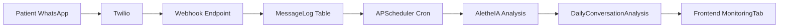

# 📊 Monitorización Premium - Technical Documentation

## Overview

The **Monitorización** feature provides real-time clinical surveillance of patient WhatsApp communications. It captures, transcribes, analyzes, and visualizes conversations to detect risk patterns and emotional states.



---

## 1. Ingestion Layer

### Twilio Webhook
**File**: [twilio_webhook.py](file:///Users/humbert/Documents/KuraOS/backend/app/api/v1/twilio_webhook.py)

| Field | Description |
|-------|-------------|
| Endpoint | `POST /api/v1/webhooks/twilio/whatsapp` |
| Auth | Twilio signature (production) |
| Response | Empty TwiML (no auto-reply) |

**Features**:
- Cleans phone number (`whatsapp:+34...` → `+34...`)
- Looks up patient by phone
- Handles audio messages via Whisper transcription
- Deduplicates by `MessageSid`

### Audio Transcription
**File**: `app/services/transcription.py`

Uses **OpenAI Whisper** API for audio-to-text:
- Detects audio MIME types (`audio/ogg`, `audio/mpeg`, etc.)
- Downloads from Twilio with auth
- Returns transcription appended to message content

---

## 2. Storage Layer

### MessageLog Table
**Model**: [models.py:1424](file:///Users/humbert/Documents/KuraOS/backend/app/db/models.py#L1424-1461)

| Column | Type | Description |
|--------|------|-------------|
| `id` | UUID | Primary key |
| `patient_id` | FK | Patient reference |
| `direction` | Enum | `INBOUND` / `OUTBOUND` |
| `content` | Text | Message text (or transcription) |
| `provider_id` | String | Twilio MessageSid (unique) |
| `timestamp` | DateTime | Indexed for batch queries |

### DailyConversationAnalysis Table
**Model**: [models.py:1464](file:///Users/humbert/Documents/KuraOS/backend/app/db/models.py#L1464-1504)

| Column | Type | Description |
|--------|------|-------------|
| `id` | UUID | Primary key |
| `patient_id` | FK | One per patient per day |
| `summary` | Text | AletheIA clinical summary |
| `sentiment_score` | Float | -1.0 (crisis) to 1.0 (positive) |
| `emotional_state` | String | "Ansioso", "Reflexivo", etc. |
| `risk_flags` | JSONB | `["Ideación Suicida", ...]` |
| `suggestion` | Text | Action for therapist |
| `message_count` | Int | Messages analyzed |

---

## 3. Analysis Engine

### APScheduler Cron Job
**File**: [main.py:56-81](file:///Users/humbert/Documents/KuraOS/backend/app/main.py)

- **Schedule**: Configurable (currently 1 hour interval)
- **Manual Trigger**: `POST /admin/ai/analyze` (Settings page)
- **Function**: `analyze_daily_conversations()`

### Conversation Analyzer Worker
**File**: [conversation_analyzer.py](file:///Users/humbert/Documents/KuraOS/backend/app/workers/conversation_analyzer.py)

**Flow**:
1. Find patients with messages in last 24h without today's analysis
2. Build chat transcript: `Paciente: ... / Sistema: ...`
3. Call `aletheia.analyze_chat_transcript(transcript)`
4. Store result in `DailyConversationAnalysis`
5. Trigger `RISK_DETECTED_IN_CHAT` event if flags present

### AletheIA Chat Analysis
**File**: [aletheia.py:549-627](file:///Users/humbert/Documents/KuraOS/backend/app/services/aletheia.py#L549-627)

**Prompt Philosophy**:
- Differentiates "integration processing" vs "crisis"
- Watches for medication compliance keywords
- Detects crisis indicators: "oscuridad", "sin salida", "voces"

**Output JSON**:
```json
{
  "summary": "Paciente reporta insomnio...",
  "sentiment_score": -0.3,
  "emotional_state": "Vulnerable/Abierto",
  "risk_flags": [],
  "suggestion": "Recomendar técnicas de grounding..."
}
```

---

## 4. Frontend Visualization

### MonitoringTab Component
**File**: [MonitoringTab.tsx](file:///Users/humbert/Documents/KuraOS/apps/platform/components/MonitoringTab.tsx)

**API Calls**:
- `GET /patients/{id}/monitoring/analyses?days=7`
- `GET /patients/{id}/monitoring/messages?days=7`

**Features**:
- Risk Alert Banner (pulsing red if `risk_flags.length > 0`)
- Sentiment Chart (7-day trend)
- Daily Insights Feed

### Supporting Components
| Component | Purpose |
|-----------|---------|
| `SentimentChart` | Line chart of sentiment_score over time |
| `DailyInsightsFeed` | Timeline of daily summaries + suggestions |

---

## 5. API Endpoints

**File**: [monitoring.py](file:///Users/humbert/Documents/KuraOS/backend/app/api/v1/monitoring.py)

| Endpoint | Method | Description |
|----------|--------|-------------|
| `/patients/{id}/monitoring/analyses` | GET | Daily analyses (7-30 days) |
| `/patients/{id}/monitoring/messages` | GET | Raw message logs |
| `/monitoring/alerts` | GET | Org-wide risk alerts (dashboard) |

---

## 6. Current State & Observations

| Aspect | Status |
|--------|--------|
| **Data Flow** | ✅ Complete end-to-end |
| **Cron Interval** | 1 hour (configurable in `/admin`) |
| **Demo Data** | Cleared after Golden Seed (expected) |
| **Audio** | Whisper transcription active |
| **Risk Events** | Triggers `RISK_DETECTED_IN_CHAT` automation |

### Note on Empty State
Since the Golden Seed was run, historical demo messages are cleared. New patients will show "Sin datos de WhatsApp" until real messages arrive via Twilio.

---

## 7. Future Enhancements (Q1 Roadmap)

1. **Real-time Updates**: WebSocket push instead of polling
2. **Outbound Capture**: Log therapist → patient messages
3. **Media Analysis**: Image/video attachment processing
4. **Trend Alerts**: Automated flags for sentiment decline over 3+ days
